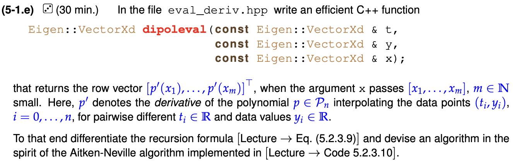
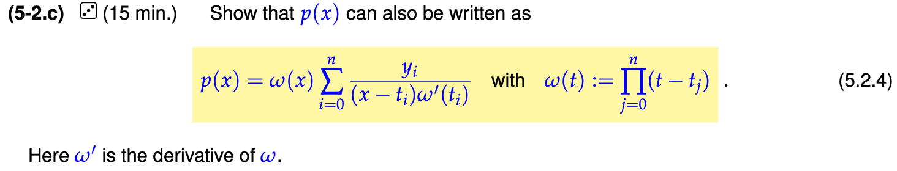
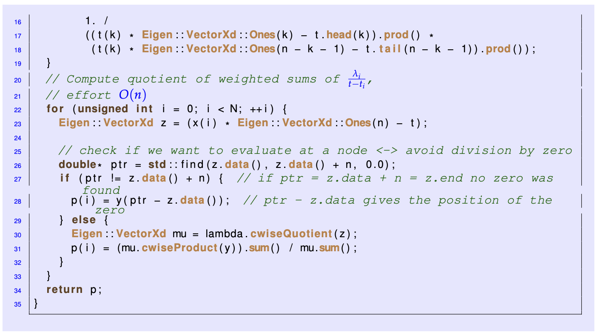
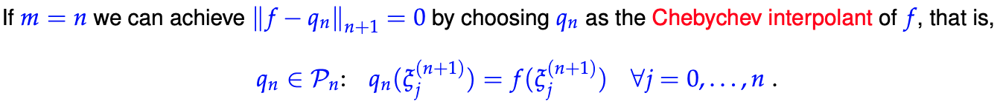
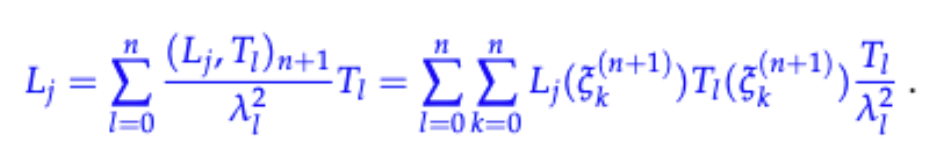

# Exercises for Numerical Methods for CSE

## Direct Methods for Linear Systems of Equations

### Problem 2-6: Banded matrix

**(a) Coding: Computation of $\mathbf{y=Ax}$** 

Exploiting the diagonal structure of the matrix and do the matrix $\times$ vector multiplication.

**(b) Demonstration: Prove matrix $\mathbf{A}$ is invertible.**

Assume by contradiction that $\text{ker}\ \mathbf{A}\neq\{0\}$ (用反证法). Pick $\mathbf{x}\in\text{ker}\ \mathbf{A}$ and derive the contridiction.

**(c) Coding: solving $\mathbf{Ax=r}$**

The Matrix is already upper diagonal, we don't need to conduct the forward elimination, just conduct the backward substitution.

**(d) Coding: Compute the solution of the linear system of equations $\mathbf{Ax=r}$ by Gaussian elimination.**

*Analysis: not use any built-in linear solvers of Eigen. We have to write the forward and backward process of GE by ourself. Due to the reason that the matrix is band-stored, we cannot execute the GE as discussed in the lecture.*


From this example we see a pattern that suggests the following general algorithm (linear-algebra indexing!).

- Forward Elimination:


- Back Eliminaition:


==Not clearly Understand.==

**(e) Demonstration: Derive the asymptotic complexity**

In the code Code 2.6.e we use three for-loops: one loop of size $n$ and two loops of size, at most, 3 each (exploiting the banded structure of $\mathbf{A}$), thus $O(n · 3 · 2)$ operations. Thirdly, for the backward substitution we use two loops, one of size $n$ and the other of size, at most, 3, thus $O(n · 3)$ operations. Therefore, the total complexity amounts to $O(12n)$ operations, which results in $O(n)$ asymptotic complexity

This is the specific GE based on the structure of the matrix $\mathbf{A}$. Therefore, the asymptoic complexity is much smaller than $O(n^3)$.

**(f) Coding: Solving LSE using Eigen's sparse elimination**

*View [Eigen](https://eigen.tuxfamily.org/dox/group__TutorialSparse.html).*

Include `#include <Eigen/Sparse>`.

### Problem 2-8: Lyapunov equation

Mostly, any linear system of equations with a finite number of unknowns can be written in the “canonical form” $\mathbf{Ax=b}$ with a system matrix $\mathbf{A}$ and a right hand side vector $\mathbf{b}$. However, the linear sys- tem may be given in a different form and it may not be obvious how to extract the system matrix. We propose an intriguing example and also present an important *matrix equation*, the so-called Lyapunov equation.

**(a) Demonstration: prove the mapping is linear**

Proven: $L(\alpha\mathbf{X}+\beta\mathbf{Y})=\alpha L(\mathbf{X})+\beta L(\mathbf{Y})$

**(b) Recall the notion of sparse matrix**


**(c) Demonstration: Reshape the Lyapunov equation into vector form**

More general derivation can be viewed in the (d).

**(d) Demonstration: Use the Kronecker product $\bigoplus$ to find a general expression for $\mathbf{C}$ in terms of $\mathbf{A}$**


**(e) Coding: Implement a C++ function that builds the Eigen matrix $\mathbf{C}$ from $\mathbf{A}$**

We found that $\mathbf{C}$ is a sparse matrix after reshaping from $\mathbf{A}$.

**(g) Demonstration:**


### Problem 2-10: Rank-one pertubations


**(a) CODING** 


==Ansewer:==

```c++
  Eigen::VectorXd ev = d;
  lnew = d.cwiseAbs().minCoeff();
  
  while (std::abs(lnew - lmin) > tol * lmin){
    lmin = lnew;
    Eigen::MatrixXd M = d.asDiagonal();
    M += ev * ev.transpose();
    ev = M.lu().solve(ev);
    ev.normalize();
    lnew = ev.dot(M * ev);
  }
```

==Tricks:==

1. Convert a vector into a diagonal matrix: [Eigen](https://eigen.tuxfamily.org/dox/classEigen_1_1MatrixBase.html) `d.asDiagonal()`
2. Absolute of matrix (vector is a special case of matrix in Eigen): `d.cwiseAbs()` or `d.array().abs()`. [Reference](https://qa.1r1g.com/sf/ask/1773865831/) 
3. Minimum of matrix `d.minCoeff()`
4. Tensor product: `ev * ev.transpose()` Dot product:`ev.dot(M * ev)` or `ev.tranpose() * (M * ev)`
5. Normalization of a vector: `ev.normalize()`
6. Solving a LSE $\mathbf{Mx=b}$: `x = M.lu().solve(b)` 
7. <font color=red> Instead of computing the inverse of a matrix $\mathbf{M^{-1}}$, solve a linear system of equations $\mathbf{Mx=I}$ </font>
   - 

**(b) DEMONSTRATION**


==Answer:==

Solving the linear system with matrix $\mathbf{M}$ (line 10) is the most relevant contributor to the asymptotic complexity. The complexity of solving a linear system is generally $\mathcal{O}(n^3)$.

**(c) CODING**


==Answer:==


```C++
  Eigen:: VectorXd ev = d;
  lnew = d.cwiseAbs().minCoeff();
  Eigen::VectorXd dinv = (1. / d.array()).matrix();
  while (std::abs(lnew - lmin) > tol * lmin){
    lmin = lnew;
    Eigen::VectorXd ev0 = ev;
    
    Eigen::VectorXd Aib = dinv.cwiseProduct(ev);
    const double temp = ev.transpose() * Aib;
    ev = Aib / (1+temp);
    ev.normalize();
    // Better than the corresponding naive implementation.
    // This holds from M = diag(d) + ev ∗ evt, too
    lnew = ev.transpose() * d.cwiseProduct(ev) + pow(ev.transpose() * ev0, 2)
  }
```

==Tricks==

1. In Eigen, Matrix and Array are two different objects,。
   1. Array类提供通常意义上的数组，它提供一些方便的对元素的非线性操作。例如让所有元素都加上一个常量，或者让两个Arrays的值对应相乘。Array类模板与Matrix相似，其含义参见Matrix类介绍。Array在其存储形式上具有矩阵的形式，只是说Array支持的运算和Matrix不一样。通常Matrix object是对整个矩阵做运算，而Array则是对其中的元素做运算。通常，如果要支持线性代数的操作，就选择Matrix；如果要进行coefficient-wise操作，就选择Array。如果又要支持线性代数操作，又要支持coefficient-wise操作，那么就可以使用.array()和.matrix()实现类型的转换，这种转换是没有计算代价的。这些操作也不会改变调用该函数的矩阵或者数组本身而是返回一个副本。[Reference](https://blog.csdn.net/naibula/article/details/122906472)
   2. 与Matrix与线性代数相关，Array类提供一个通用的数组。具体的，Array能够提供一个coefficient-wise操作，该类操作是没有线性代数意义的。如，增加一个常数到array每一个元素（coefficient）中，或者两个array对应元素相乘。coefficient-wise个人理解应该是逐元素运算，换句话说就是每个元素都执行的运算。[Reference](https://blog.csdn.net/weixin_39258979/article/details/119666598)。Matrix的运算遵守矩阵运算规则，Array则提供更加灵活的运算，比如对应系数相乘，向量加数量等，为Matrix提供了所谓coefficient-wise的运算补充。[Reference](https://blog.csdn.net/qq_40259395/article/details/113876079)。Similarily, we can use `Matrixobject.cwiseProduct` etc. to do the coefficicent-wise operations.

2. If we want to use diaginal matrix to multiply a vector, we can directly use the coefficient-wise product. `lnew = ev.transpose() * d.cwiseProduct(ev) + pow(ev.transpose() * ev0, 2)` transform all the matrix arithmetics into coefficient-wise operations.

**(d) DEMONSTRATION**


==Answer:==
The loop body of the C++ function *rankoneinvit_fast* only consists in vector-vector multiplications. The new asymptotic complexity is therefore $\mathcal{O}(n)$.

**(e) CODEING**


==Answer:==

```c++
  double lmin;
  Eigen::VectorXd d;
  Timer tm_slow, tm_fast;
  
  std::cout<< std::endl\
  <<std::setw(15)<<"n"<<std::setw(15)<<"Slow"<<std::setw(15)\
  <<"Fast"<<std::endl;
  
  for (unsigned int n = 2; n <=256; n<<=1){
    tm_slow.reset();
    tm_fast.reset();
    for (unsigned int r = 0; r < repeats; ++r){
      d = Eigen::VectorXd::LinSpaced(n,1,2);
      
      tm_slow.start();
      lmin = rankoneinvit(d, tol);
      tm_slow.stop();
      
      tm_fast.start();
      lmin = rankoneinvit_fast(d, tol);
      tm_fast.stop();
    }
    std::cout<<std::setw(15)<<n<<std::scientific<<std::setprecision(3)\
    <<std::setw(15)<<tm_slow.min()<<std::setw(15)<<tm_fast.min()<<std::endl;
  }
```

==Tricks:==

1. Use `timer.h`, `Timer tm_slow, tm_fast`, `tm_slow.reset();`, `tm_fast.reset();` for counting time.
2. Use `std::sets(15)` for alignment. Use `std::scientific<<std::set precision(3)` for output.
3. We can use `\` for code in different line.

## Direct Methods for Linear Squares Problems

### Problem 3-2: Estimating a Tridiagonal Matrix


**(a) DEMONSTRATION**


==Answer:==


==Tricks:==

The key idea is that we should move the unknown $\alpha$ and $\beta$ out of the matrix, and $\mathbf{z}$, $\mathbf{c}$ into the matrix.

**(b) DEMONSTRATION**


==Answer:==


**(c) CODING**


==Answer:==

```c++
  const unsigned int n = z.size();
  Eigen::MatrixXd A(n, 2);
  A(0,0) = z(0);
  A(0,1) = z(1);
  A(n-1,0) = z(n-1);
  A(n-1,1) = z(n-2);
  for(unsigned int i=1; i < (n - 1); ++i){
    A(i,1) = z(i);
    A(i,2) = z(i-1) + z(i+1);
  }
  Eigen::MatrixXd lhs = A.transpose() * A;
  Eigen::MatrixXd rhs = A.transpose() * c;
  x = lhs.lu().solve(rhs);
```

- <font color=purple>Still be some problems: seems like 关于变量的赋值方面</font>

### Problem 3-10: Fitting of (relative) Point Locations from Distances


**(a) DEMONSTRATION:**


==Answer:==

- The number of equations is $\frac{1}{2}n(n-1)$. The number of nonzero entries is $\frac{1}{2}n(n-1)-(n-1) = (n-1)^2$
- Therefore, The COO format (→ [Lecture → § 2.7.1.1]) requires a minimum of $2(n − 1)^2$ integers and $(n − 1)^2$ real numbers (two integers and one real number for every non-zero entry).
- • the CRS format needs $(n − 1)^2 + \frac{1}{2}n(n − 1) + 1 = (\frac{3}{2}n−1)(n − 1)$ integers (one for every nonzero entry, array *col_idx* and another one for every row plus one sentinel, array *row_ptr*) and nnz(A) =$(n − 1)^2$ real numbers, array val, see [Lecture → § 2.7.1.4].

And the structure of the matrix can be viewed as follows:


Its general structure is as follows:


**(b) CODING:**


==Answer==

```c++
Eigen::SparseMatrix<double> initA(unsigned int n) {
  const unsigned int rows = n * (n - 1) / 2;
  const unsigned int cols = n - 1;
  Eigen::SparseMatrix<double> A(rows, cols);
  // TODO: (3-10.b) Initialize the sparse coefficient matrix for
  // the distance fitting problem
  // START
  A.reserve(Eigen::VectorXi::Constant(n-1,n-1));
  //Loop through the n-1 columns of the matrix
  for (unigned int i = 0; i<cols;++i){
    const unsigned int offset = cols * i - i * (i-1) /2;
    for (unsigned int k=0; k<cols-i;++k){
      //set the -1's in C_k 
      A.insert(offset + k,i) = -1;
      //set the identity blocks of C_k
      if (k < cols - i -1){
        A.insert(offset + k, i+k+1) =1;
      }
    }
  }
  // END
  A.makeCompressed();
  return A;
```

- For a sparse matrix, we should use `mat.insert(i,j)` for setting an entry of the sparse matrix.
- The workflow for setting such matrix is: define (using `Eigen::Sparse`) $\rightarrow$ reserver $\rightarrow$ initialization (as usual) $\rightarrow$ compressed

**(c) CODING:**


==Answer:==


```c++
```

Alternatively, the matrix of the extended normal equations can be built from scratch based on an intermediate COO format. This time, direct initialization of a sparse matrix and the use of `reserve()` is complicated, because of different numbers of non-zeros entries in different row/columns of the system matrix of the extended normal equations.

**(d) DEMONSTRATION:**


**(e) CODING:**


**(f) CODING:**


**(g) DEMONSTRATION:**


### Problem 3-16: Compact Storage Format for QR-Factorization

## Direct Methods for Linear Least Squares Problems II

### Problem 3-9: Matrix Fitting by Constrained Least Squares

### Problem 3-12: Polar Decomposition of Matrices

### Problem 3-15: Low-rank Approximation of Concatenated Matrices

## Data Interpolation and Data Fitting in 1D

### Problem 5-1: Evaluating the derivatives of interpolating polynomials


==Solution:==

```c++
  px = c(0);
  for (int i = 1; i < s; ++i){
    px = x*px + c(i);
  }
  // horner scheme for derivates
  dpx = (s-1)*c(0);
  for (int i =1; i < s-1; ++i){
    dpx = x*dpx + (s-i-1)*c(i);
  }
```

==Tricks:==

- Type of return variables is pair: 
  - Using `return {px, dpx};`
  - `std::pair<double,double>`
- Be careful when deriving the horner sheme for derivates

****


==Solution:==

```c++
  for(unsigned int i = 0; i< n; ++i){
    px = px + c[i] * std::pow(x,n-i-1);
  }
  for (unsigned int i = 0; i < n-1; ++i){
    dpx = dpx + c[i] * (n-i-1) * std::pow(x,n-i-2);
  }
```

==Tricks:==

- we can use `std::pow(x,n)` to express $x^n$.


==Solution:==


==Tricks:==

- `std::pow()` is regarded as one operation, but this operation is costly and incurs constant computational cost.


==Solution:==

```c++
  const double TOL = 1e-8;
  const int max_n = std::pow(2,d);
  Eigen::VectorXd c = Eigen::VectorXd::LinSpaced(max_n+1,1,max_n+1);
  
  for(unsigned int n=2; n<=max_n;n*=2){
    Timer tm_slow, tm_fast;
    for(int r=0; r<repeats;r++){
      tm_fast.start();
      p = evaldp(c.head(n+1),x);
      tm_fast.stop();
      
      tm_slow.start();
      p_naive = evaldp_naive(c.head(n+1),x);
      tm_slow.stop();
    }
    std::cout<<std::setw(10)<<n<<std::setw(25)<<tm_fast.mean()\
    <<std::setw(25)<<tm_slow.mean()<<"\n";
    // check correctness
    double err_p = std::abs(p.first-p_naive.first);
    double err_dp = std::abs(p.second - p_naive.second);
    
    if (err_p >= TOL || err_dp >= TOL){
    std::cout<<"Discrepancy at n="<<n<<std::endl;
    return false;
    }
  }
  ret = true;
```

==Tricks:==

- Use `Eigen::VectorXd::LinSpaced(max_n+1,1,max_n+1)` to generate the vector coefficient. <font color=red>Review the Eigen sheet!!</font>
- The way for using Timer. Timer is a class, we need to define object. Subsequently using object function to calculate the time.
- How to check whether two values is equal in C++



==Solution:==


```c++
  //Non-vectorized version: loop over all evaluation points
  for (int i = 0; i< x.size();++i){
    Eigen::VectorXd p(y);
    Eigen::VectorXd dP = Eigen::VectorXd::Zero(y.size());
    // Aitken-Neville outer loop
    for (int im = 1; im < y.size(); ++im) {
      for (int i0 = im - 1; i0 >= 0; --i0) {
        dP(i0) = (p(i0 + 1) + (x(i) - t(i0)) * dP(i0 + 1) - p(i0) -
                  (x(i) - t(im)) * dP(i0)) /
                 (t(im) - t(i0));

        p(i0) = ((x(i) - t(i0)) * p(i0 + 1) - (x(i) - t(im)) * p(i0)) /
                (t(im) - t(i0));
      }
    }
    ret(i) = dP(0);
  }
```

==Tricks:==

- We should use Lagrange polynomials for interpolation. 
- `y` is a vectorXd, we use `Eigen::VectorXd p(y)` to initialize our data
-  <font color=red>NOT clear about the A-N scheme.</font>


==Solution:==

`Eigen::VectorXd dipoleval_alt(const Eigen::VectorXd &t, const Eigen::VectorXd &y, const Eigen::VectorXd &x)`

```c++
  Eigen::VectorXd P = polyfit(t,y,n-1).head(n-1);
  
  for (int i=0;i<P.size();++i){
    P(i) *= n-1-i;
  }
  ret = polyval(P,x);
```

`bool testDipolEval() `

```c++
  double TOL = 1e-8;
  const int n=10;
  Eigen::VectorXd x = Eigen::VectorXd::LinSpaced(100,-1,4);
  Eigen::VectorXd t = Eigen::VectorXd::LinSpaced(n+1,0,3);
  Eigen::VectorXd y = sin(t.array()).matrix();
  
  dPx = dipoleval(t,y,x);
  dPx_alt = dipoleval_alt(t,y,x);
  
  double err = (dPx - dPx_alt).norm();
  if (err<TOL){
    ret = true;
  }
```

==Tricks:==

- In `bool testDipolEval()`, two vector can be subtraction directly.


==Solution:==

```c++
  Eigen::VectorXd dPx;
  const int n = 10;  // polynomial degree
  Eigen::VectorXd x = Eigen::VectorXd::LinSpaced(100, 0, 3);
  Eigen::VectorXd t = Eigen::VectorXd::LinSpaced(n + 1, 0, 3);
  Eigen::VectorXd y = sin(t.array()).matrix();

  dPx = dipoleval(t, y, x);

  plt::plot(x, dPx);
  plt::title("Derivative of interpolating polynomial");
  plt::xlabel("t");
  plt::ylabel("p'(t)");
```


==Tricks:==

- Remember how to add axis to the plot

### * Problem 5-2: Lagrange Polynomials


==Solution:==


==Tricks:==

- The question is that we assume (5.2.1) is correct by default.


==Solution:==


==Tricks:==

- <font color=red>Uniquenss of this lagrange polynomial is very important. 但是为什么对满足$x,x^2,x^3,x^4,...$ 点的插值是唯一的，并且可以百分之百逼近，比如对$x$，我们不能插值出来一下斜向的震荡函数出来吗？也就是说，对于被插值函数就是polynomial形式的，我们可以百分之百逼近.</font>



==Solution:==


- Product rule for a product of several functions is very important for this problem.

### * Problem 5-8: Approximating $\pi$ by extrapolation


<font color=purple>This question is very interesting, and tell us how to transform a $n\rightarrow\infty$ to $n\rightarrow 0$, and subsequently use extrapolation to solve it.</font>


==Solutions:==


==Tricks:==

- From geometric image, we can understand this heuristics directly.
- Remeber the power series of $\sin(x)$:
- 


==Solution:==

```c++
  Eigen::ArrayXd J = Eigen::ArrayXd::LinSpaced(k - 1, 2, k);
  Eigen::ArrayXd T = 1.0 / J;  // $t_j = 1/j$
  Eigen::ArrayXd S = J * sin(M_PI * T);

  // Aitken-Neville scheme for evaluating the interpolating
  // polynomial of $(t_j,s_j)$ at x = 0.
  for (int l = 0; l < S.size(); l++) {
    for (int m = l - 1; m >= 0; m--) {
      S(m) = S(m + 1) + (S(m + 1) - S(m)) * (0.0 - T(l)) / (T(l) - T(m));
    }
  }
  // Now S(0) has contributions from all data points.
  pi = S(0);
```

==Tricks:==

- Aitken-Neville scheme $\rightarrow$ Used for single evaluation. The values of the partial Lagrange interpolants can be computed sequentially and their dependencies can be expressed by the following so-called Aitken-Neville scheme:

  

  - The order of this Aitken-Neville scheme code is that :$p_{0,1}\rightarrow p_{1,2},p_{0,2}\rightarrow p_{2,3},p_{1,3},p_{0,3}$

  - ```c++
    //Using following code for Aitken-Neville scheme
    double ANipoleval ( const VectorXd& t , VectorXd y , const double x ) { 
      for (int i = 0; i < y.size(); ++i) {
        for (int k = i − 1; k >= 0; −−k) { 
          // Recursion (5.2.3.9)
          y[k] = y[k + 1] + (y[k + 1] − y[k])*(x − t[i])/(t[i] − t[k]); 
        }
      }
      return y[0]; 
    }
    ```

- <font color=red>Don't understand the wrong of my own code</font>

  ```c++
    // Eigen::VectorXd s(k-2), j_(k-2);
    // for(unsigned int i = 0; i< k-1; ++i){
    //   j_(i) = (i+2)/1;
    //   s(i) = 1/2*(i+2)*sin(M_PI/(i+2));
    // }
    // for (unsigned int i = 0; i < s.size(); ++i){
    //   for (int j = i-1; j>=0; --j){
    //     s(j) = s(j+1) + (s(j + 1) - s(j))*(0 - j_(i))/(j_(i) - j_(j));
    //   }
    // }
    // pi = s(0);
  ```


==Solution:==

```c++
  Eigen::VectorXd K = Eigen::VectorXd::LinSpaced(kmax-1, 2, kmax);
  Eigen::VectorXd Err(K.size());
  
  std::cout<<std::setw(5)<<'k'<<std::setw(15)<<"approx. pi"\
  <<std::setw(15)<<"error"<<std::endl;
  
  for (int l = 0; l < K.size(); l++){
    double pi = extrapolate_to_pi(K(l));
    Err(l) = std::abs(pi - M_PI);
    std::cout <<std::setw(5)<<K(l)<<std::setw(15)<<pi<<std::setw(15)\
    <<Err(l)<<std::endl;
  }
  Eigen::VectorXd Deg = K - 2 * Eigen::VectorXd::Ones(kmax - 1);
  plt::semilogy(Deg, Err);
  plt::title("Approximation of pi");
  plt::xlabel("Polynomial degree");
  plt::ylabel("Error");
  plt::grid();
```


==Tricks:==

- `Eigen:VectorXd K = Eigen::VectorXd::LinSpaced(kmax-1, 2, kmax);` !!Use it to genereate the canonical vector. `Eigen::VectorXd Err(K.size());` to initialize the size of the vector
- `std::abs(pi - M_PI)` for absolute value. `M_PI` express the actual value of $\pi$.


==Solution:==


==Tricks:==

- In first chapter, we discusssed about asymptoic complexity. Subsequently, we will discussed different types of asymptotic convergence. [ Study [Lecture → § 6.2.2.9] to learn how to determine the type of convergence from error data.]
- **Exponential** convergence means that the increase of x-axis is linear, but the reduction of error is exponential.


==Solutions:==


### Problem 5-13: Various Aspects of Interpolation by Global Polynomials


==Solutions:==


1. $d$
2. $d-1$
3. 2 for $d=1$   3 for $d=2$
4. $\frac{d}{2} + 1$ for $d$ is even, $\frac{d-1}{2}+1$ for $d$ is odd.


==Solutions:==


==Solutions:==

Aitken-Neville scheme


## Approximation of Functions in 1D

### Problem 6-3: Adaptive Polynomial Interpolation




==Tricks:==

- Meaning of `argmax`: [CSDN](https://blog.csdn.net/Michale_L/article/details/122821083)
- Understanding of this posteriori adaptive strategy: Take the nodes which gives rise to huge error as our interpolation nodes. 
- This code provides the interpolation evaluation function.


==Solutions:==

```c++
  const double maxf = fvals_at_sampling_points.cwiseAbs().maxCoeff();

  // Adaptive mesh (initial node)
  std::vector<double> t{(a + b) / 2.},          // Set of interpolation nodes
      y{static_cast<double>(f((a + b) / 2.))},  // Values at nodes
      errors;                                   // Error at nodes

  for (std::size_t i = 0; i < N; ++i) {
    // *** Step 1: interpolate with current nodes
    //   need to convert std::vector to
    //   Eigen::VectorXd to use the function intpolyval
    Eigen::Map<Eigen::VectorXd> te(t.data(), t.size());
    Eigen::Map<Eigen::VectorXd> ye(y.data(), y.size());
    Eigen::VectorXd intpolyvals_at_sampling_points =
        intpolyval(te, ye, sampling_points);

    // *** Step 2: find node where error is the largest
    Eigen::VectorXd err =
        (fvals_at_sampling_points - intpolyvals_at_sampling_points).cwiseAbs();

    // We use an Eigen "Visitor"
    // https://eigen.tuxfamily.org/dox/group__TutorialReductionsVisitorsBroadcasting.html
    int idx = 0;
    const double max = err.maxCoeff(&idx);

    // Step 3: check termination criteria
    if (max < tol * maxf) {
      return te;
    }
    // Step 4: add this node to our set of nodes
    t.push_back(sampling_points(idx));
    y.push_back(fvals_at_sampling_points(idx));
```


==Tricks:==

- ```c++
  #ifndef ADAPTINTERP_HPP
  #define ADAPTINTERP_HPP
  
  #include <Eigen/Dense>
  #include <cmath>
  #include <iostream>
  #include <vector>
  
  #include "intpolyval.hpp"
  #include "matplotlibcpp.h"
  
  namespace plt = matplotlibcpp;
  ```

  Understand these header files `#ifndef INTPOLYVAL_HPP` `#define INTPOLYVAL_HPP` `#endif`

- How to use `std::vector`, see the [material](https://blog.csdn.net/tpriwwq/article/details/80609371)

- Difference between `static_cast<double>()` and `double()`. See [CSDN](https://blog.csdn.net/weixin_43331482/article/details/113666643)

- What is the different between `int` and `size_t`, `size_type`;

- ```c+
      const double maxf = fvals_at_sampling_points.cwiseAbs().maxCoeff();
      Eigen::Map<Eigen::VectorXd> te(t.data(), t.size());
      Eigen::Map<Eigen::VectorXd> ye(y.data(), y.size());
      Eigen::VectorXd intpolyvals_at_sampling_points = intpolyval(te, ye, sampling_points);
  ```

  - <font color=red>Why we just define `maxf` as `Eigen::VectorXd` directly? </font>


==Solutions:==

```c++
    if (errortab != nullptr) {
      errortab->push_back(max);
    }
  }
  std::cerr << "Desired accuracy could not be reached." << std::endl;
```

==Tricks:==


==Solutions:==

```c++
  Eigen::VectorXd tf1, tf2;      // nodes for f1 resp. f2
  std::vector<double> ef1, ef2;  // errors for f1 resp. f2

  tf1 = adaptivepolyintp(f1, a, b, tol, N, &ef1);
  tf2 = adaptivepolyintp(f2, a, b, tol, N, &ef2);
  Eigen::VectorXd n1 = Eigen::VectorXd::LinSpaced(ef1.size(), 1, ef1.size());
  Eigen::VectorXd n2 = Eigen::VectorXd::LinSpaced(ef2.size(), 1, ef2.size());
  // Plot
  plt::title("Error VS step");
  plt::xlabel("No. of interpolation nodes");
  plt::ylabel("$max |f(t) - I_Tf(t)|$");
  plt::semilogy(n1, ef1, "ro", {{"label", "$f_1(t) = sin(e^{2t})$"}});
  plt::semilogy(n2, ef2, "bo", {{"label", "$f_2(t) = \\sqrt{t}/(1 + 16t^2)$"}});
  plt::legend();
```

==Tricks:==

### Problem 6-4: Chebyshev Polynomials and their properties


Therefore, we have defined the (semi-inner and inner product) in the function space.


==Solutions:==


==Tricks:==

- Very clever way, but the upper and lower limit for integration should be noticed.


==Solutions:==


==Tricks:==

- Be clear about the concept of orthonormal and orthogonal.
- Chebyshev polynomials are independent, there is no relevance with interpolating polynomials. It is just a form of polynomials and can be used to decided the interpolated points. 
- Recall the trigonometric identity 2cos(x) cos(y) = cos(x + y) + cos(x − y). 
- ==Another way is to prove the odd function with referring $t=\cos s$==
- And I think prove 6.4.4 can only suggest that it is a orthonormal, not orthogonal.


==Solutions:==

根据definition逐个证明就行了，就是positive definiteness需要整一下。


==Tricks:==

- 引入Them. 5.2.2.7是想说明这个解是unique，也就是说，只有p=0这种情况才能满足这个positive definiteness为0。而这刚好满足我们的结论。

- （c)是要证明定义的product的合理性。(e)是要来证明在该组离散的inner product定义下，我们可以证得我们的chebychev basis 是$\mathcal{P}_n$的一组标准正交基。这个性质太重要了，也就是说，我们可以用chebychev basis来表示任意一个degree n的向量。


==Solutions:==

基于自己的求解逻辑来写就行，可能就是比较费时，不用管答案怎么写。

==Tricks:==

- Personal Solution: 
  - first part initialization: every $T_n$ is a vector, and two loops for calculating the entries in these $T_n$
  - second part testify: do the `T.dot()` to derive the solution.


==Solutions:==


==Tricks:==

- <font color=red>I can only derive before the (6.4.8).</font>


==Solutions:==


- <font color=red>之前我们一直证明的都是orthogonal，而是不是orthonormal。因此这里我们需要标准化从而实现orthonormal basis of $\mathcal{P}_m$。接下来就比较简单了，基于下面的corollary直接给出系数。

==Tricks:==


- We should understand that the best approximant is closely related to the norm.


==Solutions:==



==Tricks:==

- 始终要明白，不同于interpolation approximation，这里是基于解析和理论的方法去推的best polynomial。通常情况下$f$ is procedural form,我们没有具体的解析形式。


==Solutions:==


==Tricks:==

个人求解逻辑：


==Solutions:==


==Solutions:==

Note that (6.4.15) is a Chebychev expansion. Then use the result of Sub-problem (6-4.f) to express the coefficients of the Chebychev expansions of $L_j$


==Tricks:==

- 本文的思路就是把$L_j$当成我们的目标函数，然后用Chebychev expansion来进行近似



最核心的部分就是这个地方。

### Problem 6-9: Finding domains of analyticity


==Solutions:==


==Tricks:==


==Solutions:==


==Solutions:==


## Numerical Quadrature

### Problem 7-1: Smooth integrand by transformation (100 min)


==Solutions:==

```c++
template <class Function>
double integrate(const QuadRule& qr, const Function& f) {
  double I = 0;
  // TODO: (7-1.a) optional: compute the integral with this helper function
  // START
  size_t n = qr.nodes_.size();
  for (size_t i = 0; i < n; ++i){
    I += qr.weights_(i) * (f(qr.nodes_(i))); 
  }
  // END
  return I;
}
```

```c++
  QuadRule qr; double I;
  auto f = [fh](double x) {return std::asin(x) * fh(x);};
  for (size_t i = 1; i < N; ++i){
    qr = gaussquad(i);
    I = integrate(qr, f);
    evals.push_back(i);
    error.push_back(std::abs(I - I_ex));
    evals_ref.push_back(std::pow(i, -3));
  }
  I_N = I;
  
  //save figure
  plt::title("Gauss quadrature convergence");
  plt::loglog(evals,error,"+r", {{"label","Error"}});
  plt::loglog(evals,evals_ref,"k--",{{"label","O(n^-3)"}});
  plt::xlabel("No. of quadrature nodes");
  plt::ylabel("|Error|");
  plt::legend("best");
```

==Tricks:==

- 调用`integrate(qr, f)`的时候为什么没有指定模版函数的初始化。如过不让他默认生产，我想自己制定，应该怎么做。
- plt函数的使用
- `std::vector`的使用，这些可以学会查cpp表


==Solutions:==


==Tricks:==

- 


==Solutions:==

```c++
  QuadRule qr, qr_; double I;
  auto ft = [f](double x) {return x * f(std::sin(x)) * std::cos(x);};
  for (size_t i = 1; i <= N; ++i){
    qr = gaussquad(i);
    qr.weights_ = qr.weights_ * M_PI / 2 ;
    qr.nodes_ = qr.nodes_ * M_PI / 2;
    I = integrate(qr, ft);
    // Eigen::VectorXd w =qr.weights_ * M_PI / 2;
    // Eigen::VectorXd c = qr.nodes_ * M_PI / 2;
    // Eigen::VectorXd ftc = c.unaryExpr(ft);
    // I = w.dot(ftc);
    evals.push_back(i);
    error.push_back(std::abs(I - I_ex));
  //save figure
  plt::title("Gauss quadrature convergence");
  plt::semilogy(evals,error,"+r", {{"label","Error"}});
//  plt::loglog(evals,evals_ref,"k--",{{"label","O(n^-3)"}});
  plt::xlabel("No. of quadrature nodes");
  plt::ylabel("|Error|");
  plt::legend("best");
  }
  I_N = I;
```

==Tricks:==

- `qr.weights_ = qr.weights_ * M_PI / 2 ;` 这里自己给自己变化也可以，答案写的太啰嗦了。


==Solutions:==


### Problem 7-4: Nested numerical quadrature (85 min)


==Solutions:==


==Tricks:==

- $y$在内部积分中，相当于是一个参数


==Solutions:==

```c++
  for (size_t i = 0; i < Q.nodes_.size(); ++i){
    I += (b-a) / 2.0 * Q.weights_(i) * f((b-a) / 2.0 * Q.nodes_(i) + (b + a) / 2.0);
  }
```

==Tricks:==

- 这个地方又用了两个`&&f`,搞不懂.


==Solutions:==

```c++
  QuadRule gn = gaussquad(N);
  Eigen::VectorXd Fy=Eigen::VectorXd::Zero(N); //Point evalution at every y
  for (size_t j = 0; j < N; ++j){
    double pp = 0.5 * gn.nodes_(j) + 0.5;
    double a = 0, b = 1 - pp;
    for (size_t i = 0; i < N; ++i){
      Fy(j) += (b-a) / 2.0 * gn.weights_(i) * f((b-a) / 2.0 * gn.nodes_(i) + (b + a) / 2.0, pp);
    }
  }
  I = Fy.dot(0.5 * gn.weights_);
```

==Tricks:==

- 在有限元中我们也遇到过这类问题，当时我们的做法是把求解域用Jacobia转化到[-1,1]和[-1,1]上去，从而再选择积分点进行求解。
- 我自己写的这个版本的答案稍微有一些繁琐


==Solutions:==

```c++
  std::vector<double> error_gq, non;
  std::cout << std::setw(3) << "N" << std::setw(15) << "I_approx"
            << std::setw(15) << "error" << std::endl;
  auto f = [](double x, double y) {return std::exp(-x*x - y*y);};
  for (size_t i =1; i <= nmax; ++i){
    double I = gaussquadtriangle(f, i);
    error_gq.push_back(std::abs(I - I_ex));
    non.push_back(i);
    std::cout << std::setw(3) << i << std::setw(15) << I << std::setw(15)
              << error_gq[i-1] << std::endl;
  }
  //plot the figure
  plt::title("Gauss quadrature convergence of 2D problem");
  plt::semilogy(non, error_gq, "r+");
  plt::xlabel("No. of quadrature nodes");
  plt::ylabel("|Error|");
  plt::legend("best");
  // END
  plt::savefig("./cx_out/convergence.png");
}
```

### Problem 7-5: Quadrature plots (30 min)


==Solutions:==


==Solutions:==


### Problem 7-11: Quadrature rules and quadrature errors (80 min)


==Solutions:==


==Solutions:==


==Tricks:==

- I think this problem is a huge a trick.


==Solutions:==


==Tricks:==

- 这个地方要注意，simpson虽然只用了三个点，但是Q.R.的order是4。
- 用三角函数公式进行变化，即可知。


==Solutions:==


==Tricks:==

- 用三角函数公式进行变化
- 对于limited smoothness，G-L的斜率取决于阶数。


==Solutions:==


## Iterative Methods for Non-Linear Systems of Equations

### Problem 8-1: Convergent Newton iteration (25 min)

==Description:==

- <font color=red> This problem investigates a particular setting, in which global convergence can be expected.</font>
  - For convex monotone functions

### Problem 8-2: Code quiz (110 min)

==Description:==

- <font color=red>A frequently encountered drudgery in scientific computing is the use and modification of poorly documented code. This makes it necessary to understand the ideas behind the code first. Now we practice this in the case of a simple iterative method.</font>
- 这个题非常的巧妙，为了使得Newton Iteration收敛，用了策略来控制first values。
- 若果想通过循环来确定Newton iteratives的迭代次数，关键的步骤就是得到error recursion。当然这个问题的难度有点太大，确实不太可能直接解出来。

### Problem 8-5: Order-p convergent iterations (65 min)

==Description:==

- 主要讨论order-p基于级数公式的推导

### Problem 8-6: Order of convergence from error recursion (50 min)

==Description:==

- Observed fractional orders of convergence
- <font color=red>How to determine the order of convergence from an abstract error recursion.</font>
  - 
  - Calculate above quotients of n times and average it.

### Problem 8-8: Julia Set (105 min)

- In the coding problem, use 2-dimensional real vectors to represent complex numbers.

### Problem 8-9: Modified Newton method (145 min)

### Problem 8-10: Solving a quasi-linear system (95 min)


## Numerical Integration - Single Step Methods

### Problem 11-1: Linear ODE in spaces of matrices (75 min)
### Problem 11-2: Explicit Runge-Kutta methods (60 min)
### Problem 11-4: System of second-order ODEs (60 min)


### Problem 11-6: Order is not everything (80 min)
### Problem 11-9: Drawing Isolines of a Function (65 min)
### Problem 11-7: Initial Condition for Lotka-Volterra ODE (90 min)

# Tutorials

## References 

1. [Eigen中基本和常用函数](https://blog.csdn.net/qq_42222110/article/details/124177118?utm_medium=distribute.pc_relevant.none-task-blog-2~default~baidujs_baidulandingword~default-0-124177118-blog-106408268.pc_relevant_default&spm=1001.2101.3001.4242.1&utm_relevant_index=3)
2. 


