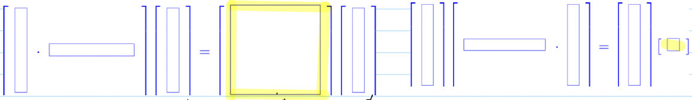
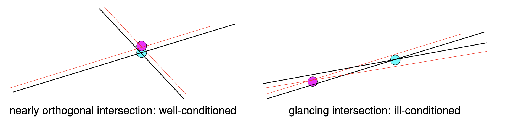
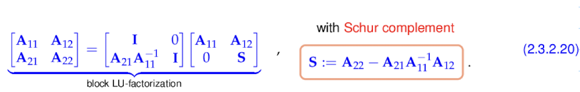
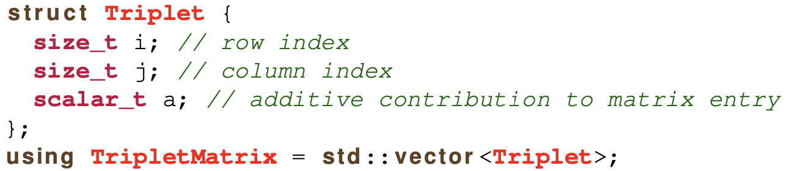
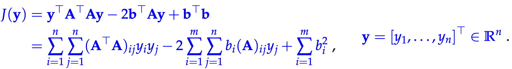
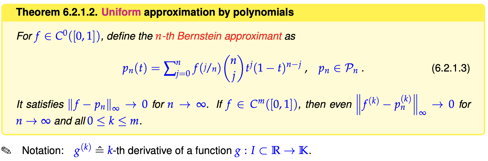
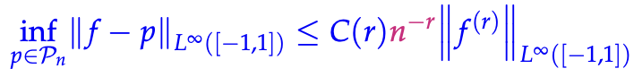

# Numerical Methods for Computational Science and Engineering


$\bbox[lightgreen]{\text{Resources}}$

1. Gitlab: https://gitlab.math.ethz.ch/NumCSE/NumCSE
2. Eigen: https://eigen.tuxfamily.org/dox/index.html
3. LaTeX: https://oeis.org/wiki/List_of_LaTeX_mathematical_symbols
   1. bold in vector: https://www.physicsread.com/latex-vector-bold/
   1. LaTeX [mathematical symbols](https://www.cmor-faculty.rice.edu/~heinken/latex/symbols.pdf)

___

**Table of contents**

[toc]


## Computing with Matrices and Vectors

### Fundamentals

$\bbox[lightgreen]{\text{Notations}}$ Vectors and Matrices are basic elements in numerical.


### Software and Libraries

#### Eigen

$\bbox[lightgreen]{\text{Eigen}}$ <font face=Times New Roman color = black size=3>Where and how can we conduct these numerical methods. </font>

- Header-only C++ template library for numerical LA.
- Fundamental data type: ==Matrix==
  - Fixed size: size known at compile time.
  - <font color = red> dynamic </font>: size known only at run time.
  - sparse matrix : a special type of data type.

$\bbox[lightgreen]{\text{Define vector type and their using in Eigen}}$ 

```c++
#include <Eigen/Dense>
template <typename Scalar>
void eigentypedemo (unsigned int dim)
{
  using dynMat_t = Eigen::Matrix<Scalar, Eigen::Dynamic, Eigen::Dynamic>;
  using dynColVec_t = Eigen::Matrix<Scalar, Eigen::Dynamic, 1>;
  using dynRowVec_t = Eigen::Matrix<Scalar, 1, Eigen::Dynamic>;
  
  using index_t = typename dynMat_t::Index;
  using entry_t = typename dynMat_t::Scalar;
  
  dynColVec_t colvec(dim);
  dynRowVec_t rowvec(dim);
  
  //initialization through component access
  for(index_t i=0; i<colvec.size();++i) colvec[i]=(Scalar)i;
  for(index_t i=0; i<rowvec.size();++i) rowvec[i]=(Scalar)i/(i+1);
  colvec[0]=(Scalar)3.14;rowvec[dim-1]=(Scalar)2.718;
  
  dynMat vecprod = colvec*rowvec;  //matrix product
  const int nrows = vecprod.rows();
  const int nclos = vecprod.cols();
}
```

- ```c++
  Eigen::Matrix  //Matrix class in Eigen namespace. It has six parameters, there of them have default values. Defining these parameter can generate corresponding class.
  //using dynMat_t = Eigen::Matrix<Scalar, Eigen::Dynamic, Eigen::Dynamic>;    create an alias for easy access
  //typedef Eigen::Matrix<Scalar, Eigen::Dynamic, Eigen::Dynamic> Matrix4x4;   create an alias for easy access
  ```

$\bbox[lightgreen]{\text{Access submatrix}}$ 

```c++
#include <iostream>
#include <Eigen/Dense>
using namespace std;

template<typename MatType>
void blockAccess(Eigen::MatrixBase<MatType> &M)
{
  using index_t = typename Eigen::MatrixBase<MatType>::Index;
  using entry_t = typename Eigen::MatrixBase<MatType>::Scalar;
  const index_t nrows(M.rows()); // No. of rows 
  const index_t ncols(M.cols()); // No. of columns
  
  cout << "Matrix M = " << endl << M << endl; // Print matrix
  // Block size half the size of the matrix
  index_t p = nrows/2,q = ncols/2; 
  // Output submatrix with left upper entry at position (i,i)
  for(index_t i=0; i < min(p,q); i++)
    cout << "Block (" << i << ',' << i << ',' << p << ',' << q 
         << ") = " << M.block(i,i,p,q) <<  endl;
  // l-value access: modify sub-matrix by adding a constant
  M.block(1,1,p,q) += Eigen::MatrixBase<MatType>::Constant(p,q,1.0);
  cout << "M = " << endl << M << endl;
  // r-value access: extract sub-matrix
  MatrixXd B = M.block(1,1,p,q);
  cout << "Isolated modified block = " << endl << B << endl;
  // Special sub-matrices
  cout << p << " top rows of m = " << M.topRows(p) << endl;
  cout << p << " bottom rows of m = " << M.bottomRows(p) << endl;
  cout << q << " left cols of m = " << M.leftCols(q) << endl;
  cout << q << " right cols of m = " << M.rightCols(p) << endl;
  // r-value access to upper triangular part
  const MatrixXd T = M.template triangularView<Upper>(); // \Label{ba:l}
  cout << "Upper triangular part = " << endl << T << endl; 
  // l-value access to upper triangular part
  M.template triangularView<Lower>() *= -1.5; // \Label{ba:2}
  cout << "Matrix M = " << endl << M << endl;
}
```

- ```c++
  //using M.block(i,j,p,q) for matrix types -> (M)i+1:j+p,j+1:j+q
  //Eigen indexing from 0
  ```

- For index in Eigen, we must use `index_t`, rather than `int`.


- Ref: [usage of using in c++](https://blog.csdn.net/weixin_51696091/article/details/127976813); [usage of typedef](https://blog.csdn.net/weixin_39269366/article/details/120481678); [usage of typename](https://blog.csdn.net/qq_43142509/article/details/125363886);

#### (Dense) Matrix Storage Formats

$\bbox[lightgreen]{\text{Motivation}}$

- Always: The entries of a (generic, dense) $A\in\mathbb{K^{m,n}}$ are stored in a <font color=red>contiguous linear array of size $m\cdot n$.</font>
- Exception: structured/sparse $\rightarrow$ diagonal/banded/triangular. 

==In this chapter, we only consider the storage format of dense matrix.==

$\bbox[lightgreen]{\text{Two different storage format}}$


- Due to the reason that the index is from 0, we need to subtract 1 when accessing these entries. Becareful~

$\bbox[lightgreen]{\text{Accessing entry in Eigen}}$

We know that the entry in matrix object can be accessed by using `()`, eg `Eigen::MatrixXd mcn(3,3); mcn(0,0)=1;`. Apart from this, there are two different methods based on the storage format to access our entries.

1. `A(i)` $\equiv$ reference for the i-th element of the array [<font color=red>closely related to the storage format (column-wise or raw-wise.</font>]

   ```c++
   using namespace Eigen;
   void storageOrder(int nrows=6,int ncols=7)
   {
     cout << "Different matrix storage layouts in Eigen" << endl;
     Matrix<double,Dynamic,Dynamic,ColMajor> mcm(nrows,ncols);
     Matrix<double,Dynamic,Dynamic,RowMajor> mrm(nrows,ncols);
     for (int l=1,i= 0; i< nrows; i++)
       for (int j= 0; j< ncols; j++,l++)
         mcm(i,j) = mrm(i,j) = l;
    
     cout << "Matrix mrm = " << endl << mrm << endl;
     cout << "mcm linear = ";
     for (int l=0;l < mcm.size(); l++) cout << mcm(l) << ',';
     cout << endl;
   
     cout << "mrm linear = ";
     for (int l=0;l < mrm.size(); l++) cout << mrm(l) << ',';
     cout << endl;
   }
   ```
   
   
   
2. `A.data()` $\equiv$ pointer [Documentation](https://eigen.tuxfamily.org/dox/group__TopicStorageOrders.html)

   

$\bbox[lightgreen]{\text{Data layout impacts efficiency}}$

Although different layouts won't affect the access of these entries for users, it will impacts the efficiency.


- **Results:** In this code, we didn't use different storage format. we just consider the ==access speed for column-wise and row-wise==. Result shows that row-wise ($\rightarrow$incur cache missing) are much solver than col-wise access.

- **Conclusion:** elements of all columns are contiguously in memory. more efficient!

- ```c++
  typedef Matrix< double, Dynamic, Dynamic > 	Eigen::MatrixXd	//Dynamic×Dynamic matrix of type double.
  ```

  - Eigen defines several typedef shortcuts for most common matrix and vector types. [documentation](https://eigen.tuxfamily.org/dox/group__matrixtypedefs.html#ga99b41a69f0bf64eadb63a97f357ab412)

### Computatioanl Effort

In numerical analysis, we often need to characterize the performance a prposed algorithm. The main idea is that calculating the number of elementary operations needed in this algorithm and regard it as the creteria. But we know that for different size of problems, the number of elementary operations is different. In order to build a universal creteria for judging an algorithm, the asymptotic complexity is proposed to chatacterize the problem tend to $\infty$.

$\bbox[lightgreen]{\text{Definition computational effort}}$


- Traditional definition: Number of elementary operations $+,-,*,\,\sqrt{s}$

Fifty years ago counting elementary operations provided good predictions of runtimes, but nowadays this is no longer true.


- Mainly determined by
  - Pattern of memory access
  - Vectorization/ pipelining

$\bbox[lightgreen]{\text{Asymptotic complexity}}$


- *Problem size parameters* in numerical linear algebra usually are the lengths and dimensions of the vectors and matrices that an algorithm takes as inputs.
- *Worst case* indicates that the maximum effort over a set of admissible data is taken into account.

- **Notation:** "Landau-0".            $Cost(n) = O(n^\alpha), \alpha > 0\ for\ n \rightarrow \infty$ 
  - Meaning: Asymptic complexity predicts the dependence of runtime of problem size for 
    - large problems
    - a concrete implementation
  - e.g.: $cost(n) = O(n^2)$; then $n\ \rightarrow 2*n$ leads to $cost\ \rightarrow 4*cost$

$\bbox[lightgreen]{\text{Computational cost of basic numerical LA operations}}$


- For matrix product, triple-loop implementation (faster implementation available $O(n^{2.36})$, if Remart 1.4.2.2 in lecture notes)

**Experiments: **Runtimes of elementary linear algebra operations in Eigen

implementation based on Eigen, m = n


- A <font color=red>doubly logarithmic plot. </font> 
  - [If $cost(n)=O(n^\alpha)$ $\Rightarrow$ data points aligned in a doubly logarithmic plot, the slope is determined by $\alpha$.]

$\bbox[lightgreen]{\text{Some tricks to improve complexity}}$

In computations involving matrices and vectors complexity of algoritms can often be reduced by performing the operations in a particular order.

**Example:** Exploit associativity

$\bf{a},\ \bf{b},\ \bf{x}\ \in \R$ (column vectors), 





**Example:** Hidden summation

For $\bf{A},\ \bf{B} \in \R^{n,p}, p \ll n,\ \bf{x} \in \R^{n}$, asymptotic complexity of the following code in Eigen:


$$
\bf{y}=triu(\bf{AB^T})\bf{x}
$$

- $\bf{triu}$ means upper triangular part

$\Downarrow$ Can we do better?

For case $\bf{p}=1$: $\bf{A},\ \bf{B}\ \leftrightarrow \bf{a},\ \bf{b}\ \in \R^{n}$. $(\bf{ab^T})_{i,j}=a_{i}b_{j}, 1 \leq i, j \leq n$


Luckily, we have effecient algorithm for 
$$
\begin{bmatrix}
1 & \cdots & 1\\
\vdots & \ddots & \vdots\\
0 & \cdots & 1 \\
\end{bmatrix}
\bf{x}
$$

- $cost(n)=O(n)$; Total cost $=O(n)$.

For case $\bf{p>1}:$

Trick: $\bf{AB^T}=\sum_{i=1}^{p} \underbrace{(A)_{:,i}(B)_{:,i}^{T}}_{\R^{n,n}}$.             Trip-operation is linear: $\text{triu}(\bf{AB^T}=\sum_{i=1}^{p}\text{triu}((A)_{:,i}(B)^T_{:,i}))$
$$
\text{triu}(\bf{AB^T})=\sum_{i=1}^{p}\text{triu}((A)_{:,i}(B)_{:,i}^T)x
$$

- total cost $O(np)$

**Example:** Reuse of intermediate results


Task: given $\bf{A},\ \bf{B}\ \in \R^{n,n},\ \bf{x}\ \in \R^{n^2}$ we want to compute $\bf{y} = \underbrace{(\bf{A}\otimes\bf{B})}_{\in \R^{n^2, n^2}}\bf{x}$.    [Naive implementation: cost $=O(n^4)$]


with partitioned vector $\bf{x}=[\bf{x^1}\ \bf{x^2}\ \dots\ x^l ]^T,\ x^l\in\R^n$

Idea: precompute $\bf{Bx^l},\ l=1,\ \dots,\ n$

$\bf{Z} = B \cdot \underbrace{[x^1,\ \dots,\ x^n]}_{\in \R^{n,n}}= [Bx^1,\ \dots ,\ Bx^n] \rightarrow$ requires $O(n^3)$ operations

$(\bf{A})_{1,1}Bx^{1} + (\bf{A})_{1,2}Bx^{2} + \dots + (\bf{A})_{1,n}Bx^{n}=Z(A)^{T}_{1,:} \rightarrow Form: y=ZA^T \rightarrow cost\ O(n^3)$

Results vector: $\bf{y}= [(y)_{:,1}\ \dots\ (y)_{:,n}]^T \in \R^{n^2}$               Total cost: $O(n^3)$

- <font color=red>  Remark: Reshaping operations at no cost! Just a reinterpretation of arrays </font>


### Machine Arithmetic and Consequences

#### Experiment: Loss of Orthogonality

Let's use the following example to introduce the machine arithmetic. 

$\bbox[lightgreen]{\text{Gram-Schmidt orthonormalization}}$


- $\bf{Q}:=[q^1\ \dots \ q^j]$  If no stop ($j=k$) then $\bf{Q^{T}Q = I} \Leftrightarrow \{q^j\}^{k}_{j=1}$ is <font color=red> orthonormal </font>
- $\text{span} \{\bf{q^1,\ \dots,q^l}\}=\text{span} \{\bf{a^1,\ \dots,a^l}\}$


We use above algorithm to run for Hilbert Matrix $\textbf{A}=[\frac{1}{i+j-1}]^{n}_{i,j=1} \in \R^{n,n}, n=10$

$\Rightarrow \bf{Q^{T}Q}=$


- From the result, we can see that it is unreasonable. Let's explain it in following chapter.

#### Machine Number + Roundoff Errors

$\bbox[lightgreen]{\text{Definition}}$

The reason, why computers must fail to execute exact computations with real numbers is clear:

 

- Different from real number, $\R$. In computer/numerical analysis, we introduce machine numbers, $\mathbb{M}$. 

- ==And computers compute in $\mathbb{M},$== Which will give rise to following outcomes due to its properties:

  - **Finite:** overflow/underflow

  - **Discrete in $\R$:** Roundoff errors (1.5.3).    ==This is the essential properties in numercial analysis!==

    - op $\equiv$ elementary arithmetic operation $\in \{ +,-,*,/ \}$ 

    - op: $\mathbb{M} \times  \mathbb{M} \nRightarrow \mathbb{M}$

    - In order to avoid this problem, in real situation, hardware implementation replace op with $\widetilde{\text{op}}$.      $\widetilde{\text{op}} \equiv \text{rd} \cdot \text{op}$ [<font color=red>Find the machine number nearest the solutions. </font>]

      

    - The approximation $\widetilde{\text{op}}$ will give rise to the error. However, the good news is that: <font color=red> Relative error</font> of $\widetilde{\text{op}}$ can be controlled.

      - $$
        \text{rel. err.}: \frac{|\widetilde{\text{op}}(x,y)-\text{op}(x,y)|}{|\text{op}(x,y)|}=\frac{|\text{(rd-1)op}(x,y)|}{|\text{op}(x,y)|} \equiv \text{relative error of rd}
        $$

      - Guaranteed:  $\underbrace{\text{max}}_{x \in |\mathbb{{M}}|}\frac{|\text{rd}(x)-x|}{|x|} \equiv \text{{EPS}} \approx2.2\cdot10^{-16}\ \text{{for double}}$ [<font color=red> Can be controlled to improve the precision of the computer, which shrink the distance between adjacent machine numbers </font>]

        $|\mathbb{M}|=[\text{min}\{|x|,x\in\mathbb{M}\},\text{max}\{|x|, x\in\mathbb{M} \}]\subset \R \Leftrightarrow \text{rd}(x)=x(1+\varepsilon),\ \text{with}|\varepsilon|\leq \text{EPS}$

        ==we refer $\text{EPS}$ as <font color=red>machine precision</font> (of $\mathbb{M}$)==

      - 

        This means that all roundoff is controlled by the machine precision. We can use above formula to analyze the roundoff in our algorithm. Notice that the concrete algorithm will contain numerious $\text{op}$, the roundoff error will accumulate during the process. Advanced topics about roundoff analysis won't discuss in the lecture.

$\bbox[lightgreen]{\text{Remarks about 1.5.1}}$

Let's come back to the chapter 1.5.1, we have two remarks about it.

**Remarks:** Impact of roundoff can be vastly different for different implementations


- In this new code, we try a different method (line 11 12) to calculate the $\bf{Q}$ matrix. And the result is perfect.
- This tells us different algorithms have different sensitivity to roundoff.

**Remarks:** Translate the stopping rule in numerical codes


- Due to the roundoff error, the final result cannot end with $q^{j}=0$. We must replace it with a relative smallness.

#### Cancellation

Why worry about EPS-sized errors? $\Rightarrow$ Because of error amplification

$\bbox[lightgreen]{\text{Examples of cancellation}}$

**Examples:** Zeros of a quadratic polynomial $\rightarrow$ based on discriminant formula


Apply above algorithm to this: $p(\xi)=\xi^2\underbrace{-(\gamma+1/\gamma)}_{=\alpha}\xi+\underbrace{1}_{\equiv \beta}=(\xi-\gamma)(\xi-1/\gamma)$


- Huge relative error for small root $1/\gamma$ if $\gamma\gg1$

In order to understand this phenomena, let's consider: <font color=red> Cancellation:</font> Extreme amplification of relative error during the subtraction of numbers of equal size.


- We look at the *exact* subtraction of two almost equal positive numbers both of which have small relative errors (red boxes) with respect to some desired exact value (indicated by blue boxes). The result of the subtraction will be small, but the errors may add up during the subtraction, ultimately constituting a large fraction of the result.

Another condition:


- ==When discussing about cancellation, we often refer to relative errors. As above, the absolute error may be unchanged, but the relative will greatly imporve due to the nearly zero values after subtraction.==

$\downarrow$ Now, let's go back to the discriminant formula

When $\gamma \gg 1 \Rightarrow \alpha \gg1\ and\ \beta=1 \Rightarrow \sqrt{D} \approx \alpha$               Cancellation will happen here:`(-alpha + wD)/2;`    


**Examples:** Cancellation in different quotients

$f: \R \rightarrow \R : f'(x)=\frac{f(x+h)-f(x)}{h}\ for\ h\ll1 \Rightarrow\ Cancellation\ in\ numerictor\ for\ h\approx0$


- Minimal relative error for $h\approx\sqrt{\text{EPS}}$    [<font color=red> This is the minimal relative error that can be achieved in this computer! </font>]


**Examples:** Cancellation & Orthogonalization


- The reason for failure of naive Gram-Schmidt orthogonalisation


$\bbox[lightgreen]{\text{Avoiding cancellation}}$

**Example 1:** Stable discriminant formula

$p(\xi)=\xi^2+\alpha\xi+\beta\ \text{with roots}\ \xi_{1},\xi_{2}\ \in \R$                 vieta's theorem: $\xi_{1}\cdot\xi_{2}=\beta,\ |\xi_{2}|>|\xi_{1}|$

Idea: 1. Compute large root (no cancellation)  2. $\xi_{1}=\beta/\xi_{2}$


**Example 2:** Recasting Expression

- $\int_{0}^{x}\sin(t)dt=1-\cos(x)=2\sin^{2}(x/2)$  $1-\cos(x)\rightarrow \text{cancellation for }x\approx0$        $2\sin^{2}(x/2)\rightarrow \text{no cancellation}$

- $$
  y=\sqrt{1+x^2}-\sqrt{1-x^2} \leftarrow \text{cancellation for }x\approx0\\
  = (\sqrt{1+x^2}-\sqrt{1-x^2})(\sqrt{1+x^2}+\sqrt{1-x^2})/(\sqrt{1+x^2}+\sqrt{1-x^2})\\
  =2x^2/(\sqrt{1+x^2}+\sqrt{1-x^2}) \rightarrow \text{no cancellation}
  $$

  - NOTE: cancellation is harmless for $x\approx1$

==Analytic manipulation offer ample opportunity to rewrite expressions in equivalent form immune to cancellation==

**Example 3:** Trading cancellation for approximation
$$
I(a)=\int_{0}^{1}e^{at}dt=\frac{e^{a}-1}{a} \leftarrow\text{cancellation for }a=1
$$
Idea: <font color=red>Approximation</font> by Taylor polynomial for $a\approx0$

$f:\R\rightarrow\R$ smooth
$$
f(x_0+h)=\sum^{m}_{k=0}\frac{f^{(k)}(x_0)}{k!}h^{k}+\underbrace{\frac{1}{(m+1)!}f^{(m+1)}(\xi)h^{m+1}}_{\text{remainder term, }\xi \in]x_{0},x_{0}+h[}
$$
Apply with $f(x)=e^x,\ x_0=0,\ h-a$            $f^{(k)}(x)=e^x$

$I(a)=$

$\tilde{I}_m(a)=\sum^{m}_{k=0}\frac{1}{(k+1)!}a^k\ \text{:an approximation of }I(a)$

THEN, the key question is how to choose $m$?          Goal: Relative function error $\ll \text{tol}$

LUCKILY, we can calculate the error by the remainder term:


- NOTE: $log_{10} \text{ rel. err.} \approx\text{no. of decimal digits}$
- Hence, keeping $m = 3$ terms is enough for achieving about 10 valid digits.


#### Numerical Stability (of Algorithm)

$\bbox[lightgreen]{\text{Defintion of Problem}}$

From the perspective of mathematics, problem can be defined as a function/mapping ($\text{Problem} \equiv \text{a function/mapping}$). Solving a problem is to find such function/mapping. In the view of numerical methods, we need to use numberical methods to build such function/mapping.

We have seen that a particular “problem” can be tackled by different “algorithms”, which produce different results due to roundoff errors. This section will clarify what distinguishes a “good” algorithm from a rather abstract point of view.


- In this course, both the data space $\it{X}$ and the result space $\it{Y}$ will always be subsets of finite dimensional vecor spaces.

**Example 1:** Matrix $\times$ Vector multiplication

$F: (A,\textbf{x})\in X \rightarrow A\textbf{x}\in\textbf{y}$            $X=\R^{m,n}\times\R^{n}$             $\textbf{y}=\R^m$

==NEXT, we need to define norm such that we can measure the perturbation in the data space and the results space.==

- On $\R^n$ we use <font color=red> vector norms</font>, e.g. $\|\cdot\|_{2}\equiv\text{Euclidean norm, }\|\cdot\|_{1},\ \|\cdot\|_{\infty}$

- <font color=red> Matrix norms</font> induced by vector norms:

  

$\bbox[lightgreen]{\text{Stable algorithm}}$


- $\tilde{F}\equiv$ algorithm affected by roundoff.         $w(x)\equiv$ #ops (number of algebraic operations)
- 
- Note that "Exact ata hardly ever available": input $\pi, 1/3$

- Sloppily speaking, the impact of roundoff on a stable algorithm is of the same order of magnitude as the effect of the inevitable pertubations due to rounding the input data. <font color=red>For stable algorithms roundoff errors are “harmless”.</font>

**Example1:** Testing stability of matrix$\times$vector multiplication

Problem: $(A,\textbf{x})\in\R^{m,n}\times\R^{n} \rightarrow A\textbf{x}\in \R^m$      $\textbf{y}=\tilde{F}((A,\textbf{x}))$: computed result [Euclidean vector &matrix norms]

which pertubations $(\tilde{A},\tilde{\textbf{x}})$ of data $(A,\textbf(x))$ yield $\textbf{y}=\tilde{A}\tilde{\textbf{x}}$ 
$$
\text{Possible choice: }\tilde{\textbf{x}}=\textbf{x},\tilde{A}=A+\textbf{zx}^T,\ \textbf{z}\equiv\frac{\textbf{y}-A\textbf{x}}{\|\textbf{x}\|^{2}_{2}})\in\R^m\\
\Rightarrow \tilde{A}\tilde{\textbf{x}}=A\textbf{x}+(\frac{\textbf{y}-A\textbf{x}}{\|\textbf{x}\|^{2}_{2}})\textbf{x}^T\textbf{x}=A\textbf{x}+\textbf{y}-A\textbf{x}=\textbf{y}\\
F((\tilde{A},\tilde{\textbf{x}}))=\textbf{y}\\
\|A-\tilde{A}\|_{2}=\|\textbf{zx}^T\|_{2} \leq\|\textbf{x}\|_2\|\textbf{z}\|_{2}=\frac{\|\textbf{y}-A\textbf{x}\|_2}{\|\textbf{x}\|_2}\\
\text{if} \bbox[lightgreen]{\|\textbf{y}-A\textbf{x}\|_2 \leq Cmn\cdot\text{EPS}\|\textbf{x}\|_2\|A\|_2\ (\ast)}\\
\Rightarrow\|A-\tilde{A}\|_2\leq Cmn\cdot\text{EPS}\|A\|_2\\
\text{if }(\ast) \text{ holds } \forall \text{ inputs }(A,\textbf{x})\Rightarrow \tilde{F} \text{ is stable}
$$

**Example2:** Problem with <font color=red> sensitive dependence </font> on data:

$\|F(\textbf{x})-F(\tilde{\textbf{x}})\|_\textbf{y}$ can be large for tiny $\|\textbf{x}-\tilde{\textbf{x}}\|_\textbf{x} $      Following is an example:


- Random output is a stable algorithm!

## Direct Methods for (Square) Linear Systems of Equations

### Introduction - Linear Systems of Equations (LSE)

$$
\text{LSE: } A\textbf{x}=\textbf{b}
$$

- $A\in\mathbb{K^{n,n}}$: <font color=red> square</font> system/cofficient/matrx
- $\textbf{x}\in\mathbb{K^n}$: vector of unknowns
- $\textbf{b}$: right-hand-side vector $\in\mathbb{K^n}$ 

#equation = #unknown = n $\rightarrow (A)^{T}_{i,:}\textbf{x}=(\textbf{b})_{i},i=1,\dots,n$   [$A$ scalar equation for each row of $A$]

AND this question can be simplified as the inverse problem of matrix$\times$vector multiplication:

-  Data/Input: $A,\textbf{b}$
- Sought/Output: $\textbf{x}$

### Square LSE: Theory $\rightarrow$ Linear Algebra

#### Existence and Uniqueness of Solutions

When we discuss topic about equations (no matter PDE/ODE/LSE/FE), we need firstly discuss the existence and uniqueness of this  set of equations:

Let's firstly review the concept of <font color=red>Invertible matrix</font>:


**Conclusion:**$A$ invertible: $A\textbf{x}=\textbf{b}\Rightarrow \textbf{x}=A^{-1}\textbf{b}$ unique.

$\star$ Do not use matrix inversion function to solve LSE with numerical libraries.

**Criterias for judging the existence of invertible matrix:**

- $A\in\mathbb{K^{n,n}}$ regular $\Leftrightarrow$ $\det{A}\neq0\Leftrightarrow\text{cols. lin. indep.}\Leftrightarrow\text{rows lin. indep.}\Leftrightarrow N(A)[\text{nullspace of A}]=\{\textbf{z}\in\mathbb{K}:A\textbf{z}=\textbf{0}\}=\{\textbf{0}\}$

#### Sensitivity/Conditioning of LSE

$\bbox[lightgreen]{\text{Definition}}$

<font color=red> Quantifies how small (relative) perturbation of data lead to changes of the output.</font> This concept is likely to the numerical stability of the algorithm.

Needed: vector norms & (induced) matrix norms $\|\cdot\|$

$\|M\|=\underbrace{\text{sup}}_{\textbf{x}\neq0}\frac{\|M\textbf{x}\|}{\|\textbf{x}\|}\Rightarrow \|M\textbf{x}\|\leq\|M\|\|\textbf{x}\|$				$\|\textbf{x}+\textbf{y}\|\leq\|\textbf{x}\|+\|\textbf{y}\|\Rightarrow\|\textbf{x}-\textbf{y}\|\geq\|\textbf{x}\|-\|\textbf{y}\|$

- We relate the matrix norm with vector norm and discuss the inequalities of vector norm itself.

**Examples:** Sensitivity of linear mapping. <font color=red> A simple example used to explain above conceptes.</font>

$A\in\R^{n,n}$ fixed & regular: input $\textbf{x}\rightarrow\textbf{y}=A\textbf{x}\equiv \text{output}$
$$
A\textbf{x}=\textbf{y}\leftrightarrow\textbf{x}=A^{-1}\textbf{y}\Rightarrow\|\textbf{x}\|\leq\|A^{-1}\|\|\textbf{y}\|\\
A(\not{\textbf{x}}+\delta\textbf{x})=\not{\textbf{y}}+\delta\textbf{y}\Rightarrow\|\delta\textbf{y}\|\leq\|A\|\|\delta\textbf{x}\|\\
\text{rel. pert.} \frac{\|\delta\textbf{y}\|}{\textbf{y}}\leq\frac{\|A\|\|\delta\textbf{x}\|}{\|A^{-1}\|^{-1}\|\textbf{x}\|}=\underbrace{\|A\|\|A^{-1}\|}_{\text{sensitivity}}\frac{\|\delta\textbf{x}\|}{\|\textbf{x}\|}
$$
$\star$ Sensitivity heavily depends on choice of norms.

$\bbox[lightgreen]{\text{Analysis of LSE}}$

**LET'S return back to the sensitivity/conditioning of LSE**

$A\in\R^{n,n}$ regular: $A\textbf{x}=\textbf{b}\Rightarrow(A+\delta A)(\textbf{x}+\delta\textbf{x})=\textbf{b}+\delta\textbf{b}\Rightarrow (A+\delta A)\delta\textbf{x}=\delta\textbf{b}-\delta A\textbf{x}$

Our goal is to characterize: $\|\delta\textbf{x}\|/\|\textbf{x}\|$. ==During this process, we need to define norm, which is important.==

Using following Tool (lemma):


Proof: Auxiliary estimate, $x\in\R^n$
$$
\|(I+B)\textbf{x}\|\geq\|\textbf{x}\|-\|B\textbf{x}\|\geq\overbrace{(1-\|B\|)}^{>0}\|x\|\\
\cdot\textbf{x}\neq0\Rightarrow(1+B)\textbf{x}\neq0\Rightarrow N(1+B)=\{0\}\\
\cdot\|(1+B)^{-1}\|=\underbrace{\text{sup}}_{\textbf{x}\neq0}\frac{\overbrace{\|(1+B)^{-1}\textbf{x}\|}^{\textbf{y}}}{\|x\|}=\underbrace{\text{sup}}_{\textbf{y}\in\R^n,\textbf{y}\neq0}\frac{\|y\|}{\|(1+B)\textbf{y}\|}\leq\underbrace{\text{sup}}_{\textbf{y}\neq0}\frac{\|\textbf{y}\|}{(1-\|B\|)\|\textbf{y}\|}\\
\text{Apply to } A+\delta A=A(I+A^{-1}\delta A)\\
\|(A+\delta A)^{-1}\|=\|(1+A^{-1}\delta A)^{-1}A^{-1}\|\\
\text{[Lemma 2.2.2.5] }\leq\|A^{-1}\|\frac{1}{1-\|A^{-1}\|\|\delta A\|}\\
\|\delta\textbf{x}\|\leq\frac{\|A^{-1}\|}{1-\|A^{-1}\|\|\delta A\|}\cdot(\|\delta \textbf{b}\|+\|\delta A\|\|\textbf{x}\|)\\
\|\delta \textbf{x}\|\leq\frac{\|A^{-1}\|\bbox[lightyellow]{\|A\|}}{1-\|A^{-1}\|\|\delta A\|}(\frac{\|\delta b\|}{\bbox[lightyellow]{\|A\|}\|\textbf{x}\|)}+\frac{\|\delta A\|}{\bbox[lightyellow]{\|A\|}})\|\textbf{x}\|
$$


- Specifical for ==conditiontiong of LSEs==.

$\bbox[lightgreen]{\text{Unified Cretiria of condition for LSE (condition number)}}$


==Used to define the condition/sensitivity of such setting (LSE).==

- $\text{cond}(A)\approx1$: LSE <font color=red> well-conditioned</font>
- $\text{cond}(A)\gg1$: LSE <font color=red> ill-conditioned</font>

**Example:** Visualizing sensitivity: intersection of lines in 2D


- $\textbf{x}$ represents coordinates of $L_1\cap L_2$.
- This question can also be viewed as LSE.




- $n_1$ "almost linearly dependent" of $n_2$ 								$\text{cond}(A) \rightarrow \infty$


### Gaussian Elimination (GE)

#### Basic Algorithm ($\rightarrow$LA)

$\bbox[lightgreen]{\text{Definition of GE}}$

Successive row transformation of LSE $A\textbf{x}=\textbf{b}$ to convert it to triangular form

For $A$:


For $A\textbf{x}=\textbf{b},\ A\in\R^{n,n}$


- forward elimination $\rightarrow O(n^3)$                       back substitution $\rightarrow O(n^2)$

$\bbox[lightgreen]{\text{Block GE}}$

LSE: 
$$
A\textbf{x}=\textbf{b},\ A\in\R^{n,n}, A=
\begin{bmatrix}
A_{1,1} & A_{1,2}\\
A_{2,1} & A_{2,2} \\
\end{bmatrix}\
A_{1,1}\in\R^{k,k}
$$
<font color=red> Assume: $A_{1,1}$ is regular </font>. 			

Recall: blockwise $M\times M$:


Now: GE like for $2\times2$ LSE [except for commutativity]


- 1$\rightarrow$froward elimination			2$\rightarrow$back substitution
- $S\equiv A_{2,2}-A_{2,1}A^{-1}_{11}A_{1,2}$ : <font color=red> Schur complement. </font>

$\bbox[lightgreen]{\text{Block LU-decompoition}}$


#### LU-Decomposition

$\bbox[lightgreen]{\text{Definition of LU-decompoition}}$

[Equivalent to GE] $\Rightarrow \text{cost}(LU)=O(n^3)$


- ==normalized== lower trianglular $\times$ upper triangular


$\bbox[lightgreen]{\text{Solving LSE via LU}}$

LSE: 
$$
A\textbf{x}=\textbf{b}\Leftrightarrow L(U\textbf{x})=\textbf{b}\Rightarrow L\textbf{z}=\textbf{b}, U\textbf{x}=\textbf{z}
$$


- Three-stage procedure of solving $n\times n$ linear systems of equations.
- $1\rightarrow O(n^3)$                 $2,3\rightarrow O(n^2)$


$\bbox[lightgreen]{\text{GE/LU-dec. in Eigen}}$

EIGEN supplies a rich suite of functions for matrix decompositions and solving LSEs. The default solver is Gaussian elimination with partial pivoting, accessible through the methods `lu()` and `solve()` of dense matrix types:

$A\in \R^{n,n} \leftrightarrow \text{(square) matrix object}$

LSE multiple r.h.s [contained in columns of $B$]: $A\textbf{x}=B \in \R^{n,l}$      <font color=red> Solve a set of LSEs. </font>


$\bbox[lightgreen]{\text{Many sequential solutions of LSE}}$

As we have seen above, EIGEN provides functions that return decompositions of matrices.

Based on the precomputed decompositions, a linear system of equations with coefficient matrix $A\in\mathbb{K}^{n,n}$ can be solved with asymptotic computational effort $O(n^2)$ .


- $A$ rationale for LU
- <font color=red> A high-efficient way for computing serial solutions of LSE. </font>

### Exploiting Structure when Solving Linear Systems

By “structure” of a linear system we mean prior knowledge that

- either certain entries of the system matrix vanish,
- or the system matrix is generated by a particular formula.

$\bbox[lightgreen]{\text{Trangular Linear Systems}}$

Triangular linear systems are linear systems of equations whose system matrix is a **triangular matrix**.

Above chapter tells us that (dense) triangular linear systems can be solved by backward/forward elimination with $O(n^2)$ asymptotic computational effort ($n\equiv$ number of unknowns) compared to an asymptotic complexity of $O(n^3)$ for solving a generic (dense) linear system of equations. 

This is the simplest case where exploiting special structure of the system matrix leads to faster algorithms for the solution of a special class of linear systems.

$\bbox[lightgreen]{\text{Block Elimination}}$

Let's recall Block GE:


$$
\textbf{x}_1=A_{11}^{-1}(\textbf{b}_2-A_{12}\textbf{x}_2)   \text{ from 1st row}\\
\text{into 2nd. row } \underbrace{(A_{22}-A_{21}A_{11}^{-1}A_{12})\textbf{x}_2}_{\text{Schur complement matrix}\in\R^{l,l}}=\textbf{b}_2-A_{21}A_{11}^{-1}\textbf{b}_{1}
$$
We can notice that block elimination will be ==useful, if $A_{11}\textbf{x}=\textbf{c}$ can be solved "easily".==



Let's consider a special situation: 

**LSE with arrow matrix:**

set up as follows: 

​                          

-  If we use general GE to solve this question:


​		$\text{cost}=O(n^3)$

- If we use block GE


​		$\text{cost}=O(n)$


Comparision between above two methods:


​		<font color=red> Fast code more vulnerable to round-off: instability. </font>

$\bbox[lightgreen]{\text{Solving LSE subject to low-rank modification of system matrix}}$

Assume: $A\textbf{x}=\textbf{b}$ is easy to solve, because:

- $A$ special structure
- LU-dec. available

Sought: $\tilde{\textbf{x}}:\ \tilde{A}\tilde{\textbf{x}}=\textbf{b}$, where $\tilde{A}$ arises from $A$ by changing a single entry $(A)_{i^{\star},j^{\star}}$


MORE general: <font color=red> rank-1 modification.</font>

$\tilde{A}=A+\textbf{uv}^T,\ \textbf{u},\textbf{v}\in\R^{n}$

**Trick:** Block elimination
$$
\begin{bmatrix}
A & \textbf{u}\\
\textbf{v}^T & -1\\
\end{bmatrix}
\begin{bmatrix}
\tilde{\textbf{x}}\\
\xi
\end{bmatrix}
=
\begin{bmatrix}
\tilde{\textbf{b}}\\
0
\end{bmatrix}
$$
Block row $\textbf{II}\Rightarrow\xi=\textbf{v}^T\tilde{\textbf{x}}\overbrace{\Rightarrow}^{\textbf{I}}\underbrace{(A+\textbf{u}\textbf{v}^T)}_{\tilde{A}}\tilde{\textbf{x}}=\textbf{b}$

Block row $\textbf{I}\Rightarrow\tilde{\textbf{x}}=A^{-1}(\textbf{b}-\xi\cdot\textbf{u})\overbrace{\Rightarrow}^{\textbf{II}}\xi=\textbf{v}^TA^{-1}(\textbf{b}-\xi\textbf{u})\Rightarrow\xi=\frac{\textbf{v}^TA^{-1}\textbf{b}}{1+\textbf{v}^TA^{-1}\textbf{u}}$


Generalization of (2.6.0.22)


### Sparse Linear Systems

Sparse matrix: 

- "Almost all" entries = 0
- for which it is worth while exploiting this fact

**Example: Sparse LSE in circuit simulation:**


- Every is connected to only a few other nodes. <font color=red> we can imagine that graph is also a sparse matrix in computer.</font>
- $\rightarrow \text{LSE } A\textbf{x}=\textbf{b}$      $\text{nnz}(A)\approx \#{nodes}$
- Sparse LSE arise in models of large models of large networks

#### Sparse Matrix Storage Formats

$\bbox[lightgreen]{\text{Motivation/Purposes}}$

<font color=blue>For large sparse matrix, we want to find a efficient storage way which don't affect its algebraic operation and access.</font>

- Memory $\sim$ $\text{nnz}(A)$ (number of nonzero entries)
- $\text{cost}(A\times\text{vector})\sim\text{nnz}(A)$    <font color=red> elementary operation. </font>
- provide easily accessible information about location of non-zero entries.

$\bbox[lightgreen]{\text{COO/triplet format}}$

$\rightarrow$ stores $A$ as a list/sequence tuples ($i,j$ value)



or we can use `std::vector<Eigen::Triplet<double>> triplets;`


Allowed: repeated index pairs $\rightarrow$ values summed up

$(A)_{i,j}=\sum_{K:A[K]i=j,A[K]_j}A[K].a$

$\bbox[lightgreen]{\text{Compressed row storage(CRS)}}$

$A\in\mathbb{K}^{n,n}$: stores non-zeros entries, row-oriented


- Cores of such method is that we need to identify the original location of entries in `val` vector. We use:
  - `col_ind` to identify the number of columns
  - `row_ptr`: compress data in this dimension by defining row pointer to allocate the corresponding row. If we have $n$ rows, then the size of the `row_ptr` is $n+1$. And the value define the accumulated number in each row. For example:
    - First row: $1\leq a <3$ Second row: $3\leq a < 6$ ... for `val` vector
- ==CRS: Non-zero entries reside in contiguous memory!==

#### Sparse Matrices in Eigen

Standard: CRS/CCS format


**Challenge: Efficient initialization** we don't know how to initialize `Eigen::SparseMatrix<double> asp(n,n)` quickly.

Set random entry $\Rightarrow$ massive data movement necessary

**Idea:**

1. Use intermediate COO/triplet format


2. `reserve()` & `insert()`, if nnz/per row, col known


$\bbox[lightgreen]{\text{Initialization of Sparse Matrix}}$

$A\in\R^{n,n}$ banded, $(A)_{i,j}\neq0\Leftrightarrow |i-j|\leq2$


<font color=red> Very interesting point! Time for initialization of sparse matrix will change with different methods</font>

#### Direct Solution of Sparse Linear Systems of Equations

$\bbox[lightgreen]{\text{Introduction}}$

**Assume:** System matrix in sparse matrix format$\rightarrow$tells location of zero entries$\rightarrow$can be exploited by sparse elimination techniques.

**Eigen:**


```c++
//An example in the homework
C = buildC(A); //reshape Lypunov funtion
b = Eigen::Map<Eigen::MatrixXd>(I.data(),n*n,1);
Eigen::SparseLU<Eigen::SparseMatrix<double>> solver;
solver.compute(C);
vecX = solver.solve(b);
X = Eigen::Map<Eigen::MatrixXd>(vecX.data(),n,n);
```

$\bbox[lightgreen]{\text{Sparse elimination for arrow matrix}}$

​                                    

$\bbox[lightgreen]{\text{Sparse elimination for combinatorial graph laplacian}}$

We consider a sequence of planar triangulations created by successive regular refinement (→ Def. 2.7.2.16) of the planar triangulation of Fig. 55, see Ex. 2.7.2.5. We use different EIGEN and MKL sparse solver for the linear system of equations (2.7.2.15) associated with each mesh.


- We observe an empirical asymptotic complexity (→ Def. 1.4.1.1) of $O(n^{1.5})$, way better than the asymptotic complexity of $O(n^3)$ expected for Gaussian elimination in the case of dense matrices.

In practice: cost(sparse solution of $A\textbf{x}=\textbf{b}$ ) $=O((\text{nnz}(A))^\alpha)\ \alpha\approx1.5-2.5$


- <font color=red> Never ever even think about implementing a general sparse elimination solver by yourself!</font>

## Direct Methods for Linear Least Squares Problems

<font color=blue>In this chapter, we will firstly introduce the definition of linear least squares problems.  Then, we will discuss </font>

**Analytical Solutions:**

- **Normal Equations：**For matrix with full-rank condition.
- **Moore-Penrose pseudo-inverse:** For the solution of general LSE.

**Orthogonal Transformations Methods:**

- **QR factorization:** For matrix with full-rank condition. Transfer the original matrix to triangular matrix which is easily to solve. Subsequently, the problem will be transferred into the standard LSE.
- **SVD factorization:** For the solution of general LSE.

### Overdetermined Linear Systems of Equations: Examples

$\bbox[lightgreen]{\text{Definition}}$

**Overdetermined LSE:**


- Overdetermined LSE $\rightarrow$ Always be unsolved; If it is solvable, then $[A]_{1:m,n}$ is enough for solving these problem with $n$ variables.
- Potential Question background: This situation often happens when (1) we have a lot of data points and want to use a linear model to approximate these data. (2) some data is generated by a specific linear model. However, due to the pertubation of this system, PDE not fully satisfied by these data. 

$\bbox[lightgreen]{\text{Examples of such question}}$

**Example 1:** Linear parameter estimation in 1D

Law: $y=\alpha x + \beta$ for some unknown parameter $\alpha,\beta\in\R$

Measured: $(x_i,y_i)\in\R^2,\ i=1,\dots,m,\ m>2$    

Theoretically, $y_i=\alpha x_i + \beta$    $\forall i \Rightarrow \text{LSE}$

<font color=red> However: </font> measurement errors have occurred. And this question is not a LSE problem but a regression problem. Here, we will consider linear regression. And in mathematics, linear regression can be viewed as the ==overdetermined linear systems of equations.== [<font color=blue> linear regression is just apparent, the core of it is overdetermined LSE.</font>]


**Example 2:** <font color=red> Linear regression: </font> linear parameter estimation

Law: $y=\textbf{a}^T\cdot\textbf{x}+\beta$, parameters $\textbf{a}\in\R^n,\ \beta\in\R,\ \textbf{x}\in\R^n$

Measurements: $(x_i,y_i)\in\R^n\times\R,\ i=1,\dots,m$ 

Theoretically, $y_i=\textbf{a}^T\textbf{x}_i+\beta$ (Overdetermined if $m>n+1)$

- Multi-variable linear regression. Similarly, $y$ maybe pertubation. 


**Exampel 3:** Measuring the angles of a triangle.


- $\widetilde{\alpha},\widetilde{\beta},\widetilde{\gamma}\equiv$ measured angles.    $\sum\text{angles}=\pi$
- The tenet of data science: <font color=red> You cannot afford not to use any piece of information available.</font>


**Example 4:** Angles in a triangulation

Measured: angles


- each angle is supposed to be equal to its measured value,
- the sum of interior angles is $\pi$ for every triangle,   $\rightarrow$ + #triag. Extra equations                $\Rightarrow$OD LSE
- the sum of the angles at an interior node is $2\pi$.    $\rightarrow$ + #int. Nodes extra equations.

**Example 5:** Point locations from distances

Consider $n$ points located on the real axis at unknown locations $x_{i}\in\R,i=1,\dots,n$. At least we know that $x_i < x_{i+1},\ i=1,\dots,n-1$.


If the measurements were perfect, we could then find $x_2,\dots,x_n$ from $d_{i-1,i},\ i=2,\dots,n$ by solving a standard (square) linear system of equations. However, as in above analysis, using much more information through the overdetermined system helps curb measurement errors.

### Least Squares Solution Concepts

Setting: OD-LSE $\mathbf{Ax}=\mathbf{b},\ \mathbf{A}\in\R^{m,n}, \mathbb{b}\in\R^{m},\ m\geq n$

Notation for important subspaces associated with a matrix $\mathbf{A}\in \mathbb{K}^{m,n}$

- Image/range: $\mathcal{R}(A)\equiv\{\mathbf{Ax}, \mathbf{x}\in\mathbb{K}^n\}\subset\mathbb{K}^m,$
- Kernel/nullspace: $\mathcal{N}(A)\equiv\{\mathbf{x}\in\mathbb{K}:\mathbf{Ax=0}\}$.

==$\mathbf{A}$ is not a square matrix, which means that the number of equations is not consistent with that of variables. if $m\geq n$, this means that the number of equations is larger than that of unknown variables. This is what we call the overdetermined linear system of equations.==

#### Least Squares Solutions: Definition

<font color=blue> After downing the question background, we want to figure out the potential soution of such problem.</font>

**Idea:** A LSQ sol. of $A\mathbf{x}=\mathbf{b}$ is a vector $x\in \R^n$ that makes the residual $r\equiv\mathbf{b}-A\mathbf{x}$ as small as possible (w.r.t $\|\cdot\|_{2})$


- LSQ need not be unique.    Expression: $\equiv \text{lsq}(A,b)$
- The solution is based on the definition of the norm. [<font color=red> Because norm will define the distance in the Euclidean space, and the goal of lsq is to find the shortest distance based on such norm.</font>]
- Here, $\mathbf{A}$ can be viewed as the coordinate matrix of the data, and $\mathbf{y}$ can viewed as the value matrix of the data.

$\mathbf{A}$ true generalization: $\mathbf{A} \in \R^{n,n}\text{ regular}\Rightarrow \text{lsq}(\textbf{A,b})\equiv{\mathbf{A}^{-1}\mathbf{b}}$

**Example:** 1D linear regression

OD-LSE:                    

LSQ sol.: $[\alpha\ \beta]\in\underbrace{\text{argmin}}_{\tilde{\alpha},\tilde{\beta}}\sum^{m}_{i=1}(y_{i}-\tilde{\alpha}x_i-\tilde{\beta)^2}$


- Minimize the sum of squares of vertical distances of the data point from the<font color=purple> regression line</font>.

$\bbox[lightgreen]{\text{Geometric interpretation of least squares solution}}$


- From this geometric consideration we conclude that $\text{lsq}(\mathbf{A,b})$ is the space of solutions of $\mathbf{Ax=b^{*}}$, where $\mathbf{b^∗}$ is the orthogonal projection of $\mathbf{b}$ onto $\mathcal{R}(\mathbf{A})$. Since the set of solutions of a linear system of equations invariably is an affine space, this argument teaches that $\text{lsq}(\mathbf{A, b})$ is an affine subspace of $\R^{n}$!

**Geometric intuition generates the following insights: Least squares solutions always exist**


#### Normal Equations

<font color=blue> In this chapter, the normal equation not only gives the actual solution of least squares problem $\rightarrow$ normal equation (a n$\times$n LSE), but identify when the $\text{lsq}(\mathbf{A,b})$ ($\mathbf{A}$ is a tall matrix) will have the unique solution $\rightarrow$ full-ranke condition (FRC).</font>

Setting: OD-LSE $\mathbf{Ax=b},\ \mathbf{A}\in\R^{m,n}, \mathbf{b}\in\R^{m},\ m\geq n$                     $x^*\in\text{lsq}(\mathbf{A},\mathbf{b})$


$\downarrow$ NEXT, we will obtain the **normal equation** from (1) geometric view of points; (2) algebric view of point.

$\bbox[lightgreen]{\text{Geometirc points}}$
$$
\text{residual } r\equiv \mathbf{b}-\mathbf{Ax^{*}}\perp\mathcal{R}(\mathbf{A})={\mathbf{Ay}:\mathbf{y}\in\R^n}\\
(\mathbf{Ay})^T(\mathbf{b-Ax^*})=0\ \forall\mathbf{y}\in\R^n\\
\Rightarrow\mathbf{A}^T(\mathbf{b-Ax^*})=0
$$


- $\mathbf{x}\in\text{lsq}(\mathbf{A,b})\Leftrightarrow\mathbf{A^{T}Ax=A^{T}b}$  ($n\times n$ Square LSE)


$\bbox[lightgreen]{\text{Algebric points}}$

Define: $ J: \R^n\rightarrow \R$       $J(\mathbf{y})\equiv\|\mathbf{b-Ay}\|^{2}_{2}$



- Multivariant polynomial in $\mathbf{y}$: $J$ smooth, $C^{\infty}$
- $x^{*}\in\underbrace{\text{argmin }}_{x\in\R^{n}}J(\mathbf{x})\Rightarrow\underbrace{\textbf{grad }J}_{\R^n\rightarrow\R^n}(\mathbf{x^*})=0$
- $\text{grad }J(\mathbf{y})=[\frac{\partial J}{\partial \mathbf{y_i}}(\mathbf{y})]^n_{i=1}=2\mathbf{A^{T}Ay-2A^{T}b}$

**Example:** NEQ for linear regression

#### Moore-Penrose Pseudoinverse

<font color=blue>Normal equation is the full charactericatioin of least squares problems. But we know that when the full-rank condition is not satisfied, the solution of LSQ is not unique. Here, we will give a more general criterion for linear systems of equations (including n by n and m by n). </font>

### Normal Equation Methods

<font color=blue> When we used normal equation to solve the LSQ, Usually we will face two obstacles: 1. roundoff errors $\rightarrow$ loss of information in the computation of $\mathbf{A^{T}A}$ due to the EPS; 2. loss of sparsity $\rightarrow$ for large $m,n$ $\mathbf{A}\text{ sparse} \nRightarrow\mathbf{A^{T}A}\ \text{sparse}$.</font>

### Orthogonal Transformation Methods

<font color=blue> In above section, we have introduced the **normal equation** for solving the overdertimined LSE. In this section, we will introduce another class of methods for solving LSQ inspired by Gaussian elimination. </font>

#### Idea

#### Orthogonal Matrices

#### QR-Decomposition

##### Theory 

<font color=blue> In the solution of LSE, we used the Gaussian Elimination to introduce the LU decomposition. In the solution of overdetermined LSE (tall matrix), we used Gram-Schmidt orthonormalization to  introduce the QR decomposition.</font>

##### Computation of QR-Decomposition

==? Not clearly understand==

**Motivation:** Gram-Schmidt algorithm is unstable, affected by roundoff.

**Idea:** (similar to GE$\rightarrow$row transformation) find simple unitary/orthogonal (row) transformations rendering certain matrix elements zero:


- House-holder reflection

- Given Rotation


The $\mathbf{Q}$ is stored in the encode form so that the matrix $\times$ vector can be computed quickly.

Unitary/orthogonal matrices are a little different from matrices with orthonormal columns. Unitary/orthogonal matrices must be n by n, because it is related to the regular/invertible. orthonormal vectors is defined as follows: $\mathbf{(q^i)^{T}q^j}=\delta_{ij}$ or $\mathbf{U^{H}U=I_n}$ ($\mathbf{U}$ Orthonormal columns).

- In original definition, orthonormal transformation is by multiplying a series of unitary/orthnormal matrices without changing its norm.

  

##### QR-Based Solver for Linear Least Squares Problems

### Singular Value Decomposition (SVD)

<font color=blue> In this chapter, firstly, we will review the basic theory of singular value decomposition (SVD), then we will discuss its application as follows: (1) General LSE solution (no matter any size and rank). (2) SVD-Based Optimization and Approximation.</font>

#### SVD: Definition and Theory

Another factorization based on orthogonal transformations. QR-upper triangulr matrix; SVD-diagonal matrix

#### SVD in Eigen

Computing following components:

1. Computing SVDs $\Rightarrow$ $\mathbf{U,\Sigma,V}$

2. Computing rank (concerned with roundoff)

   1. numerical rank: judging singular values one by one

   2. Using `rank()` in Eigen `A.jacobiSvd().setThreshold(tol).rank();`

      ```c++
      using index_t = MatrixXd::Index;
      Eigen::JacobiSVD<MatrixXd> svd(A,Eigen::ComputeFullV);
      index_t r = svd.setThreshold(tol).rank();
      ```

3. Computing orthonormal basis (ONB) of Nullspace and Rangespac      

#### Solving General Least-Squares Problems by SVD

Giving the general solution of Linear System based on psedo-inverse matrix by using the SVD directly.

We can given the Moore-Penrose Pseudoinverse directly by SVD decomposition.

#### SVD-Based Optimization and Approximation

##### Norm-Constrained Extrema of Quadratic Forms

The key point for the orthogonal transformation is that it don't change the norm of the vector. This will give us many inspiration of orthogonal transformation in the $\text{min/max}$ problem.

##### Best Low-Rank Approximation

<font color=blue>SVD can be used for best low-rank approximation. That is we can use small number of memory to preserve the most characteristics of the matrix.</font>

##### Principal Component Analysis (PCA)


PCA can be used for (1) Trend detection; (2)Data classification.

## Data Interpolation and Data Fitting in 1D

### Abstract Interpolation (AI)

$\bbox[lightgreen]{\text{Tasks: Data Interpolation}}$


- we have $n+1$ points; Set $V$ of eligible functions define smoothness requirements etc.
- Key points of this definition we need to understand: (a) satisfying **Interpolation conditions**; (b) The interpolated function comes from a set $V$ of eligible functions. We refer it as Interpolant.


**Examples:** Constitutive relations from measurements


- Measurements $\rightarrow$ accurate $\Leftrightarrow$ IC; Functional relation $y=f(t)$ needed for numerical.

$\bbox[lightgreen]{\text{Functions in a code}}$

**Motivation: **What does it mean to “represent” or “make available” a function $f: I\subset\R\rightarrow\R$ in a computer code?

- A general “mathematical” function $f: I\subset\R\rightarrow\R^d$, $I$ an interval, contains an “infinite amount of information”.

Rather, in the context of numerical methods, “function” should be read as “subroutine”, a piece of code that can, for any $x\in I$, compute $f(x)$ in finite time. Even this has to be qualified, because we can only pass machine numbers $x\in I\bigcap M$ and, of course, in most cases, $f(x)$ will be an approximation. In a C++ code a simple real valued function can be incarnated through a function object of a type as given in Code 5.1.0.10.


If a constitutive relationship for a circuit element is needed in a C++ simulation code (→ Ex. Above), the following specialized **Function** class could be used to represent it. It demonstrates the concrete object oriented implementation of an interpolant.


Two main components have to be designed and implemented:

1. The constructor, which is in charge of “setup”, e.g. building and solving a linear system of equations.
2. The evaluation operator **operator** (), e.g., implemented as evaluation of a linear combination

d

1. Understand interpolation operator and linear interpolation operator.

   1. Before we discussed about interpolation operator, the nodes are given. The mapping is between values in this nodes (n+1) and a resulting function (continuous function).
   2. Linear means that the operator satisfies $\mathbf{I}(\alpha\mathbf{y}+\beta\mathbf{z})=\alpha\mathbf{I}(\mathbf{y})+\beta\mathbf{I}(\mathbf{z}),\ \forall\mathbf{y,z}\in\R^{n+1},\alpha,\beta\in\R$

2. And we introduce a type of interpolation operator: **Piecewise linear interpolation**

   1. cardinal basisi: "tent functions"

### Global Polynomial Interpolation

(Global) polynomial interpolation, that is, interpolation into spaces of functions spanned by polynomials up to a certain degree, is the simplest interpolation scheme and of great importance as building block for more complex algorithms.

<font color=blue>In this lecture note, I won't discussed another typical methods-piecewise interpolation including trigonometric interpolation (generic periodic function), piecewise interpolation, etc.</font> 

Note that, interpolation operator a mapping from data

#### Uni-Variate Polynomials

#### Polynomial Interpolation: Theory

#### Polynomial Interpolation: Algorithms

Not clearly about the single evaluation.

##### Extrapolation to Zero

Inspiration: We found that that taylor expansion of a function without a remainder term is a polynomial. We can sample some points in this function, and interpolate it. Theoretically, we can approximate the function with any precision with more sampled points.

Motivation: Compute the limit $\lim_{h\rightarrow0}\psi(h)$ with prescribed accuracy, though the evaluation of the function $\psi=\psi(h)$ (maybe given in procedural form only) for very small arguments $\|h\| \ll1$ is difficult, usually because of numerical instability.


Advantage: Not only can it achieve high precision with relative small evaluation, but we can use it to achieve error control.

##### Newton Basis and Divided Differences

Motivation: 

1. Evaluation of data with different orders (another reason is that we may not be known when we receive information about the first interpolation points) simulataneously without sacrificing efficiency. However, the drawback of the lagrange basis or barycentric formula is that adding another data point affects *all* basis polynomials/all precomputed values!
2. In order to solve the leading coefficient of the interpolating polynomials with Newton basis, we have to conduct the elimination for a triangular linear system. Can we find more efficient algorithm?

Techniques: 

1. we have already discussed monomials basis, polynomial basis, cardinal basis, but we need to use an "update-frendly" basis of $\mathcal{P}_n$ $\rightarrow$Newton basis; Evaluation: we use Horner-like scheme
2. Efficient algorithm for determining leading coefficient: divided differences. (based on the A.N. -like scheme)


==The coefficients of newton basis is unknown and needed to be solved by triangular linear system equations.==

Results:

Advantages:

#### Polynomial Interpolation: Sensitivity

$\bbox[lightgreen]{\text{Motivation}}$

<font color=blue>In chapter 1.4.4, we have known that the sensitivity/conditioning of an algorithm/problem/mapping should be evaluated such that we can utilize its properly.</font>

<font color=red>Sensitivity</font> (of a problem) $\longleftrightarrow$ amplification of pertubations of data

- In chapter 1.4.4, problem means a mapping: {Data (space)} $\rightarrow$ {Result (space)}

FOR linear interpolation problem (LIP): 

- Data space: data points $(\R\times\R)^{n+1}$ or data values $\R^{n+1}$ 
- Result space: $\mathcal{P}_{n}$ (a function space, polynomial with certain order=#points)

<font color=blue>It will be difficult to gauge the sensitivity of resulting polynomial to interpolation nodes, we won't discuss about it here. Simply, we will discuss the situation where the interpolated nodes are fixed (equidistant nodes).</font>

Our focus is on <font color=red>interpolation operator, more specifically linear interpolation opeartor.</font>


$\bbox[lightgreen]{\text{Example of oscillating polynomial interpolant}}$


- Plotted is the interpolant for n=10 and the interpolant for which the data value at t=0 has been pertubated by 0.1. (large variaton at t=4.5)


In fuzzy terms, what we have observed is <font color=red>“high sensitivity”</font> of polynomial interpolation with respect to perturbations in the data values: small perturbations in the data can cause big variations of the polynomial interpolants in certain points, which is clearly undesirable.

$\bbox[lightgreen]{\text{Quantatively quantify these pertubations}}$

We need tools to quantify pertubations, we need to define <font color=red>norms</font>.

- On data space $\R^{n+1}$: $\|\mathbf{y}\|_{2},\ \|\mathbf{y}\|_{\infty}$
- On result space $\mathcal{P}_{n}\equiv$ a <font color=red>function space</font> on $I\subset\R$


(5.2.4.6) and (5.2.4.7) can be viewed as the function version of $\|\mathbf{y}\|_{2},\ \|\mathbf{y}\|_{1}$, respectively.

<font color=blue>we defined the norm in the function space (from the perspective of operator learning, this is the concept of the mapping between finite- and infinite-dimensional space) For linear interpolation operator, the input space is finite $\R^n$, but the resulting space is infinite (a continuous function space).</font>

$\bbox[lightgreen]{\text{Sensitivity of linear (problem) maps}}$

$\mathbf{I}_{\mathcal{T}}(\mathbf{y}+\delta\mathbf{y})=\mathbf{I}_{\mathcal{T}}(\mathbf{y})+\mathbf{I}_{\mathcal{T}}(\delta\mathbf{y})$ which gives rise to that pertubation: $\delta\mathbf{y}\longrightarrow\mathbf{I}_{\mathcal{T}}(\delta\mathbf{y})$


We refer it as <font color=red>operator norm</font> of $\mathbf{I}_{\mathcal{T}}$ <font color=blue>(Note!! This norm is not used for data space or result space, but for the mapping. It can be viewed as the general form of matrix norm, because matrix can be viewed as a linear mapping. Another thing that we need to be careful is that sensitivity is depended on the definition of norm. )</font>

Due to fact that the operator norm relys on norms, we use $\infty$ to derive the sensitivity:


- $\|\sum^{n}_{i=0}|L_{i}|\|_{L^{\infty}(I)}$ depends on $\mathcal{T}$ (interpolated nodes)
- we define Lebesgue constant of $\mathcal{T}$: 

Seems like if we apply differnt interpolated nodes will give rise to different **Lebesgue constant**, resulting in different sensitivity. See following results:

Node set $\mathcal{T}_n=\{-1+2\frac{k}{n}\}^{n}_{k=0}\subset I\equiv[-1,1]$


- Sophisticated theory gives a lower bound for the Lebesgue constant for uniformly spaced nodes:$\lambda_{\mathcal{T}}\geq Ce^{n/2}$ with $C>0$ independent of $n$. (expontential growth)


___

## Approximation of Functions in 1D

### Introduction

$\bbox[lightgreen]{\text{Problem background and motivation}}$

**Examples:** Model reduction in circuit simulation


- Problem description: 2-port circuite element described by $I = I(U)$. $I(U)$ is computable $\forall U$, but this is expensive
- Idea: replace $U\rightarrow I(U)$ with $U\rightarrow \tilde{I}(U)$, that (1) allows fast evaluation; (2) is "close to" $I(U)$.
- $\tilde{I}\equiv$ surrogate function [model reduction]


Different from data interpolation, now we are free to choose the number and location of the data points, because we can simply evaluate the function *U* → *I*(*U*) for any *U* and as often as needed.

$\bbox[lightgreen]{\text{General function approximation problem}}$


Let's clearify the meaning of some terms:

- "Procedural form": only point evaluation possible. Don't have a explicit function formula. ==This is why we will discuss data interpolation for appromation after.==
- "Approximation error $\mathbf{f-\tilde{f}}$": is a function

- 

- 

  Needed: norms on function spaces:

  - The <font color=red>supremum norm:</font> 

    If the approximation error is small with respect to the supremum, $\tilde{\mathbf{f}}$ is also called a good uniform approximant of $\mathbf{f}$.

  - The <font color=red>$L^2$-norm:</font> , see [this](#Polynomial Interpolation: Sensitivity) for more norms about function space.

Below we consider only the case *n* = *d* = 1: approximation of scalar valued functions defined on an interval. The techniques can be applied componentwise in order to cope with the case of vector valued function (*d* > 1).

$\bbox[lightgreen]{\text{Difference between approximation and interpolation}}$


Compared with data interpolation, we have two new things:

1. Dataset is not given, we need to generate data by ourself $\rightarrow$ Sampled methods
2. Defined norm for the function error.

### Approximation by Global Polynomials

#### Theory

Polynomials: these polynomials are discussed when we talk about data interpolation, and can be used as the basis for data interpolation.

-  (Uni-variate)/(general) polynomials $\rightarrow$ moninomals 
-  Lagrange polynomials $\rightarrow$ lagrange basis
-  Newton polynomials $\rightarrow$ newton basis

Confusing cocepts: these two concepts are sometimes confused, but they are not polynomials or not used for interpolation.

-  ~~Piece-wise polynomials~~ $\Rightarrow$piece-wise interpolation [Discussed when we talk about interpolation]
-  Taylor polynomials $\Rightarrow$ for approximating function [Not used for interpolation, but for approximation. If your function is analytic, we can use Taylor polynomials with $\infty$ degree. for accurate approximation. But it should be noted that the result can only be accurate into the region of convergence. If not in the domain, we need to use complex tools.] - 通常是taylor series

==Some polynomials are introduced based on data interpolation, for example Lagrange/Newton. Basis of these polynomials is based on interpolated nodes. And the degree of these polynomials is the same as the number of interpolation points. Some polynomials are not related to the interpolation, including Taylor and general polynomials.==

$\bbox[lightgreen]{\text{Background}}$

We found that: Taylor polynomials are "natural" for approximation. For $f\in C^{k}(I),\ k\in\N,\ I\subset R$, we approximate


- Local approximation of <font color=red>*sufficiently smooth*</font> functions by polynomials is a key idea in calculus, which manifests itself in the importance of approximation by Taylor polynomials.
- ==In real cases, the function is the procedural form, we cannot use such methods.==

$\bbox[lightgreen]{\text{Theory}}$

Taylor polynomials corresponding to Taylor expansion of a function, which tells us polynomials are "natural" for approximation.  

$\Downarrow$ The question is, 

1. Whether polynomials still offer uniform approximation on arbitrary bounded closed intervals and for functions that are merely continuous, but not any smoother.

2. How well polynomials can approxmate function beyond Taylor?

$\Downarrow$ The answer for (1) is YES and this profound result is known as the [Weierstrass Approximation Theorem](https://en.wikipedia.org/wiki/Stone%E2%80%93Weierstrass_theorem). Here we give an extended version with a concrete formula due to Bernstein, see as follows:

**Uniform approximation theorem**: 



- ==This theorem tells us any continuous function can be approximated by a polynomial (Bernstein approximant) with enough degrees. Taylor also needs the existence of derivates for the function.==
- Good news is that there is little restriction for the funtion
- Bad news is that we have no further informaiton about $\|f-p_n \|_{\infty}\rightarrow0$: how fast/well the approximated function compared with the original function. ==(也就是当degree增加时，逼近的程度逐渐怎么变化。Taylor can give us truncated term for analysis.)==

$\Downarrow$ AND Jackson therorem tells us more about the bad news if it has more smoothness of the original function. We can derive the upper bound for the best approximation polynomials with degree $n$. [Review the definition of [inf & sup](https://blog.csdn.net/Anne033/article/details/115323682) ]


- The best approximation polynomial $p$ of degree $k$ with respect to norm $\|\cdot\|$.  


- And $\uparrow$ Jackson theorem gives us the upper bound based on norm $L_{\infty}$ for the best approximation error, which means that if we can figure out the best approximation polynomial, the error of it will be less than that.   ==Upper bound for max-norm of <font color=red>best-approximation error</font>==
- ==NOTE that the Jackson theorem is not relevant to the Bernstein approximant.==

==Bernstein tells us that the universal approximation theorem of polynomials (Bernstein approximant). Jackson theorm tells us the quantitatively change of the best-approximation error with the change of the degree of polynomial. But they are both theoretical analysis, just like Neural Network, it didn't tell us the concrete form of best approximation polynomials==

WE can see that this bound formula is a little difficult, for a simpler bound: reveals asymptotics for $n\rightarrow\infty$



with *C*(*r*) dependent on *r*, but *independent of* *f* and, in particular, the polynomial *degree* *n*. Using the Landau symbol from chapter 1 we can rewrite the statement of (6.2.1.13) in asymptotic form: 

- In chapter 1, the Landau symbol is used for asymptoic complexity.
- This asymptoic form is very important, which tells us the convergence speed of the upper bound for best approximation. And it is referred as <font color=red>algebraic convergence</font> with rate $r$ for $n\rightarrow\infty$. But this upper bound is very loose, we can further decrease it to achieve expontential convergence. (see the following chapters)
- ==And we still need to understand that these formula tells us the expressivity of the polynomials for function approximation (just theory analysis). It didn't tell us how to derive such best approximation polynomial for function. We can image that if we want to derive the expressivity of neural networks for function approximation, we can use the similiar trick. And the result is that we can derive the upper bound of best approximation error for function.==

$\bbox[lightgreen]{\text{Transformation of approximation error estimation}}$

Jackson theory only tell us the upper bound for function approximation on the interval [-1,1], can it tell us the upper bound on [a,b]? Let's first consider that whether we can transform a polynomial approximation scheme from [-1,1] to [a,b].

$\Downarrow$ Tool: Bijective affine linar transformation

Assume that an interval $[a,b]\subset \R,\ a<b$, and a polynomial approximation scheme $\hat{A}:C^0([-1,1])\rightarrow\mathcal{P}_n$. Based on the affine linear mapping


we can introduce the affine <font color=red>pullback</font> of functions:


- ! Remember $\Phi^\ast(f)(\hat{t})$

- Transformation of norms under pullback:

  

- $p\in\mathcal{P}_n\Rightarrow\Phi^{\ast}p\in\mathcal{P}_n$

- Transformation of norms under affine pullbacks don't change.

**Pullback & derivation** ($\Phi\leftrightarrow$ dilation)

By the 1D chain rule: , which implies a simple scaling rule for derivatives of arbitrary order $r\in\N_0$:


$\bbox[lightgreen]{\text{Polynomial best-approximation error estimation on general intervals}}$


And we end up with the simpler bound


$\bbox[lightgreen]{\text{Transformation of polynomial approximation schemes}}$

We use affline pullback function for us to analyze the upper bound of best approximaiton error with interval [a,b] in above discussion. Here, we can also use it for transformation of polynomial approximation schemes in different intervals.

We can define a polynomial approximation scheme $A$ on $C^{0}([a,b])$ by


when $\hat{A}$ is a polynomial approximation scheme on [-1,1].

#### Error Estimates for Polynomial Interpolation

$\bbox[lightgreen]{\text{Introduction}}$

The choice of node set is very important, which will help us build the mapping (interpolation scheme/operator and approximation scheme/operator). $\mathbf{I}_{\mathcal{T}}$ interpolation scheme/operator is based on nodes.


NOW, we introduce Lagrangian approximation scheme. 


- $\mathbf{L}_\mathcal{T}(f)$: mapping function space $\rightarrow$ function space; $\mathbf{I}_{\mathcal{T}}$ mapping vector space $\rightarrow$ function space.

 $\bbox[lightgreen]{\text{Convergence of interpolation errors}}$

Consider sequencies of node sets $(\mathcal{T}_n)_{n\in\N}$, the number of $\mathcal{T} = n+1\leftrightarrow$ degree of polynomials

**Example:** I = [a,b]: equidistant nodes


For families of Lagrange interpolation schemes $\{\mathbf{L}_{\mathcal{T}_{n}}\}_{n\in\N_0}$ we can shift the focus onto estimating the asymptotic behavior of the norm of the interpolation error for *n* → ∞.


- $C\neq C(n)$ mean: independent of $n$! 
- $C$ $\rightarrow$ "generic constant", generally unknown
- Here, we don't expect to give the accurate upper bound for the approximation error, but want to give the asymptotic convergence of the approximation error. 
- NOTICE: Here, we didn't discuss best approximation error. the result is based on the approximation scheme scheme/nodes we choose.

$\bbox[lightgreen]{\text{Asymptoic behavior of lagrange interpolation error}}$


$\bbox[lightgreen]{\text{Classification of asymptoic behavior of the interpolation error}}$


$\bbox[lightgreen]{\text{Determining type of convergence in numerical experiments}}$

"Measured": $(n_{i},\varepsilon_{i}) \in \N\times\R^{+}$ for $i =1,2,\dots$, where $\varepsilon$ means error norm


$\log(\varepsilon_i/\varepsilon_{i-1})\approx-p\log(n_i/n_{i-1})\rightarrow p$  $n\rightarrow ?$ for $\varepsilon\rightarrow\varepsilon/2$ ==这种直接列出两个误差的比较值即可==


==By numerical experiments, we can know the asymptoic convergence of an approximation operator.==

##### Convergence of Interpolation Errors

##### Interpolation of Finite Smoothness

Though polynomials possess great power to approximate functions, see Bernstein approximation scheme, here polynomial interpolants fail completely. Approximation theorists even discovered the following “negative result”:


==Just like artificial neural network, although it possesses great power for approximating functions, we cannot express its power at most cases.==


Now we aim to establish bounds for the supremum norm of the interpolation error of Lagrangian interpolation similar to the result of Jackson’s best approximation theorem.

It states a result for at least continuously differentiable functions and its bound for the ==polynomial best approximation error== involves norms of certain derivatives of the function *f* to be approximated. Thus some smoothness of *f* is required, but only a few of derivatives need exist. Thus, we say, that this chapter deals with functions of finite smoothnes, that is, *f* ∈ $C^k$ for some *k* ∈ N. In this section we aim to bound polynomial interpolation errors for such functions.

##### Analytic Interpolands


$\bbox[lightgreen]{\text{Motivation}}$

We have seen that for some Lagrangian approximation schemes applied to certain functions we can observe exponential convergence of the approximation error for increasing polynomial degree. This section presents a class of interpolands, which often enable this convergence.

$\bbox[lightgreen]{\text{Example: Hump function}}$

whose radius of convergence = 1. More generally, deeper theory tells us that the Taylor series at $t_0$ has radius of convergence = $\sqrt{t^{2}_{0} + 1}$. Thus, in [−5, 5] cannot be represented by a single power series, though it is a perfectly smooth function.  ==This is very interesting! This function can only be accurately calculated by Taylor series on small sub-intervals.==

<font color=red>In last chapter, we discussed about the blow-up of the interpolation error with degree of the polynomial for hump function.</font>

$\bbox[lightgreen]{\text{Remark: Analytic function everywhere}}$

$\bbox[lightgreen]{\text{Approximation by truncated power series}}$

$\bbox[lightgreen]{\text{Residue calculus}}$

Why go $\C$? The reason is that this permits us to harness powerful tool from <font color=red>complex analysis</font>, a field of mathematics, which studies analytic functions. One of theses tools is the residue theorem.


- $p$ is a complex point. $\Pi$ often stands for the set of <font color=red>poles</font> of $f$, that is, points where "$f$ Attains the value $\infty$".

#### Chebychev Interpolation

##### Motivation and Definition

Now, based on the insight into the structure of the interpolation error gained before, we seek to choose “optimal” sampling points. They will give rise to the so-called Chebychev polynomial approximation schemes, also known as Chebychev interpolation.


Of course, an *a posteriori* choice based on information gleaned from evaluations of the interpoland *f* may yield much better interpolants (in the sense of smaller norm of the interpolation error). Many modern algorithms employ this a posteriori adaptive approximation policy, but this chapter will not cover them.[See Problem 6-3]


##### Chebychev Interpolation Error Estimates


## Numerical Quature

### Introduction

### Quadrature Formulas/Rules

### Polynomial Quadrature Formulas

### Gauss Quadrature

#### Order of a Quadrature Rule

#### Maximal-Order Quadrature Rules

#### Gauss-Legendre Quadrature Error Estimates

### Composite Quadrature

### Adaptive Quadrature


## Iterative Methods for Non-Linear Systems of Equations

Iterative Methods for $F({\mathbf{x}})=0$

1. Fixed point iteration - analytical form of F。后面的是procedural form即可，point evalutaion。
2. Bisection - Stable and derivative free method
3. Newton Methods - 一阶和二阶连续要求
4. Multi-point - 和Newton Methods同属于model function points,replace $F$ with interpolating polynomial. Didn't use derivatives information of $F(\mathbf{x})$
5. secant method - based on inverse interpolation,这个方法真的好妙啊。发挥了interpolation的优势和procedural form的优势。

下面定义了iterative methods方法的重要metrics，asymptotic efficiency efficiencey = # digits gained / total work required

## Numerical Integration - Single Step Methods

### Initial-Value Problems (IVPs) for ODEs

#### Ordinary Differential Equations (ODEs)

**Solution of ODE:**


- J is an open interval for time.
- A solution describes a continuous trajectory in state space, a one-parameter family of states, parameter- ized by time.
- right hand side relys on time and state. For and atonomous ODE (right hand side function does not depend on time, but only on state), the right hand side function defines a vector field.


**Smoothness of solutions inherited from the right hand side function.**


**A simplest class of ODEs, linear ordinary differential equations**


#### Mathematical Modeling with Ordinary Differention Equations

#### Theory of IVPs


$\Downarrow$ IVPs for autonomous ODEs

Hence, for autonomous ODEs we have *I* = R and the right hand side function **y** → **f**(**y**) can be regarded as a stationary vector field (velocity field), see Fig. 394 or Fig. 397. An important observation: If *t* → **y**(*t*) is a solution of an autonomous ODE, then, for any *τ* ∈ R, also the shifted function *t* → **y**(*t* − *τ*) is a solution.


$\Downarrow$ From high-order ODEs to first order systems


$\Downarrow$ Smoothness classes for right-hand side functions

Now we review results about existence and uniqueness of solutions of initial value problems for first-order ODEs. These are surprisingly general and do not impose severe constraints on right hand side functions. Some kind of smoothness of the right-hand side function **f** is required, nevertheless and the following definitions describe it in detail.


The following is the the most important mathematical result in the theory of initial-value problems for ODEs:


- Explain the domain of definition of solutions of IVPs
  - 
  - domains of definition $J(t_0,\mathbf{y}_0)$: that is the domain of the solution for ode with the initial conditions ($t_0,\mathbf{y}_0$). The reason why we define this is that we found the solution may be blow-up under specific initial conditions. ==Intrinsic life-span of solutions, for maximal <font color=red>(temporal)</font> domain of definition==

#### Evolution Operators

$\Downarrow$ Evolution Operators

Now we examine a difficult but fundamental concept for time-dependent models stated by means of ODEs. For the sake of simplicity we ==restrict the discussion to autonomous initial-value problems (IVPs)== (<font color=red>NOTE that the discussion about the evolution operator is under the restriction of IVPs</font>)

with locally Lipschitz continuous (→ Def. 11.1.3.13) right hand side **f** : *D* ⊂ R*N* → R*N*, *N* ∈ N, and make the following assumption. A more general treatment is given in


Now we return to the study of a generic ODE (ODE) instead of an IVP (11.1.3.2). We do this by temporarily changing the perspective: we fix a “time of interest” *t* ∈ R \ {0} and follow all trajectories for the duration *t*. This induces a <font color=red>mapping of points in state space</font>:


- <font color=red>It can be viewed as a mapping with two arguments, a duration t and an initial state value $\mathbf{y}_0$


There is a one-to-one relationship between ODEs and their evolution operators, and those are the key objects behind an ODE.


Understanding the concept of evolution operators is indispensable for numerical integration, that the is the construction of numerical methods for the solution of IVPs for ODEs:


### Introduction: Polygonal Approximation Methods

### General Single-Step Methods

#### Definition

#### (Asymptotic) Convergence of Single-Step Methods

Approximation errors in numerical integration are also called discretization errors.

Depending on the objective of numerical integration as stated in § 11.2.0.1 different (norms of) discretization errors are of interest: ==We need to define our errors for analyzing.==


Specified discrete evolution $\Psi$, the single step method is fixed:


- ==Only way to control the accuracy of the solution is through the selection of the mesh.==
- 


### Explicit Runge-Kutta Single-Step Methods (RKSSMs)

### Adaptive Stepsize Control

Algorithm building temporal mesh $\mathcal{M}=\{{t_k}\}^{\mathcal{M}}_{k=0}$  during execution of SSM 

## Single-Step Methods for Stiff Initial-Value Problems

### Model Problem Analysis

### Stiff Initial-Value Problems

这一章主要讲了怎么通过线性化来判断一个ODE是否为Stiff IVP


$\Downarrow$ derivation


==Learning the theory about how to find stiff problem==


**Remark 12.2.0.16 (Characteristics of stiff IVPs)** Often one can already tell from the expected behavior of the solution of an IVP, which is often clear from the modeling context, that one has to brace for stiffness.


### Implicit Runge-Kutta Single-Step Methods

Recall:


In the previous problem, we only discussed the explicit problem for the Stiff IVP. In this chapter, we started to view some implicit problems.

The goal in this chapter is to introduce a new approach for such still IVP.

Our discussion is located at the complex plane.


<font color=red> Unconditional stability</font>: no timestep constraint for stability analysis. [The potential of implicit method]

$\Downarrow$ We want to give a more general/high-order SSM

Goal: unconditionally stable SSMs of high order


