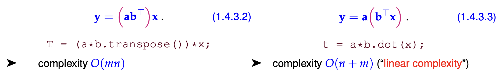
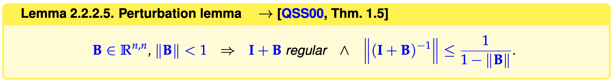
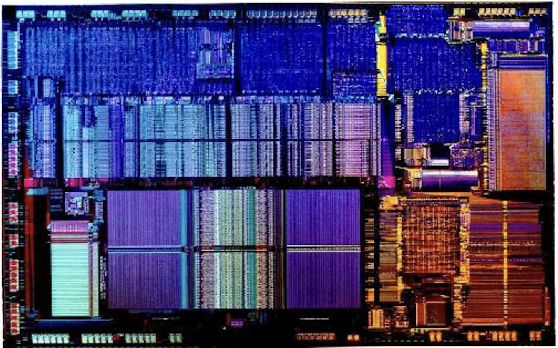
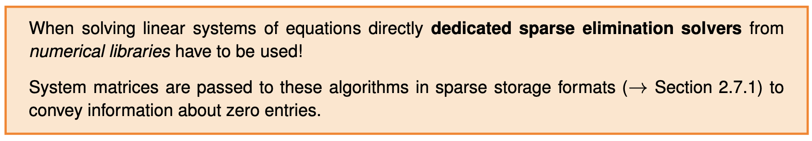

$\bbox[lightgreen]{\text{Resources}}$

1. Gitlab: https://gitlab.math.ethz.ch/NumCSE/NumCSE
2. Eigen: https://eigen.tuxfamily.org/dox/index.html
3. LaTeX: https://oeis.org/wiki/List_of_LaTeX_mathematical_symbols
   1. bold in vector: https://www.physicsread.com/latex-vector-bold/
   1. LaTeX [mathematical symbols](https://www.cmor-faculty.rice.edu/~heinken/latex/symbols.pdf)
   
4. 

# 1. Computing with Matrices and Vectors

## 1.1 Fundamentals

$\bbox[lightgreen]{\text{Notations}}$ <font face=Times New Roman color = black size=3> Vectors and Matrices are basic elements in numerical. </font>


## 1.2 Software and Libraries

### 1.2.1 Eigen

$\bbox[lightgreen]{\text{Eigen}}$ <font face=Times New Roman color = black size=3>Where and how can we conduct these numerical methods. </font>

- Header-only C++ template library for numerical LA.
- Fundamental data type: ==Matrix==
  - Fixed size: size known at compile time.
  - <font color = red> dynamic </font>: size known only at run time.
  - sparse matrix : a special type of data type.


$\bbox[lightgreen]{\text{Define vector type and their using in Eigen}}$ 

```c++
#include <Eigen/Dense>

template <typename Scalar>
void eigentypedemo (unsigned int dim)
{
  using dynMat_t = Eigen::Matrix<Scalar, Eigen::Dynamic, Eigen::Dynamic>;
  using dynColVec_t = Eigen::Matrix<Scalar, Eigen::Dynamic, 1>;
  using dynRowVec_t = Eigen::Matrix<Scalar, 1, Eigen::Dynamic>;
  
  using index_t = typename dynMat_t::Index;
  using entry_t = typename dynMat_t::Scalar;
  
  dynColVec_t colvec(dim);
  dynRowVec_t rowvec(dim);
  
  //initialization through component access
  for(index_t i=0; i<colvec.size();++i) colvec[i]=(Scalar)i;
  for(index_t i=0; i<rowvec.size();++i) rowvec[i]=(Scalar)i/(i+1);
  colvec[0]=(Scalar)3.14;rowvec[dim-1]=(Scalar)2.718;
  
  dynMat vecprod = colvec*rowvec;  //matrix product
  const int nrows = vecprod.rows();
  const int nclos = vecprod.cols();
}
```

- ```c++
  Eigen::Matrix  //Matrix class in Eigen namespace. It has six parameters, there of them have default values. Defining these parameter can generate corresponding class.
  //using dynMat_t = Eigen::Matrix<Scalar, Eigen::Dynamic, Eigen::Dynamic>;    create an alias for easy access
  //typedef Eigen::Matrix<Scalar, Eigen::Dynamic, Eigen::Dynamic> Matrix4x4;   create an alias for easy access
  ```


$\bbox[lightgreen]{\text{Access submatrix}}$ 

```c++
#include <iostream>
#include <Eigen/Dense>
using namespace std;

template<typename MatType>
void blockAccess(Eigen::MatrixBase<MatType> &M)
{
  using index_t = typename Eigen::MatrixBase<MatType>::Index;
  using entry_t = typename Eigen::MatrixBase<MatType>::Scalar;
  const index_t nrows(M.rows()); // No. of rows 
  const index_t ncols(M.cols()); // No. of columns
  
  cout << "Matrix M = " << endl << M << endl; // Print matrix
  // Block size half the size of the matrix
  index_t p = nrows/2,q = ncols/2; 
  // Output submatrix with left upper entry at position (i,i)
  for(index_t i=0; i < min(p,q); i++)
    cout << "Block (" << i << ',' << i << ',' << p << ',' << q 
         << ") = " << M.block(i,i,p,q) <<  endl;
  // l-value access: modify sub-matrix by adding a constant
  M.block(1,1,p,q) += Eigen::MatrixBase<MatType>::Constant(p,q,1.0);
  cout << "M = " << endl << M << endl;
  // r-value access: extract sub-matrix
  MatrixXd B = M.block(1,1,p,q);
  cout << "Isolated modified block = " << endl << B << endl;
  // Special sub-matrices
  cout << p << " top rows of m = " << M.topRows(p) << endl;
  cout << p << " bottom rows of m = " << M.bottomRows(p) << endl;
  cout << q << " left cols of m = " << M.leftCols(q) << endl;
  cout << q << " right cols of m = " << M.rightCols(p) << endl;
  // r-value access to upper triangular part
  const MatrixXd T = M.template triangularView<Upper>(); // \Label{ba:l}
  cout << "Upper triangular part = " << endl << T << endl; 
  // l-value access to upper triangular part
  M.template triangularView<Lower>() *= -1.5; // \Label{ba:2}
  cout << "Matrix M = " << endl << M << endl;
}
```

- ```c++
  //using M.block(i,j,p,q) for matrix types -> (M)i+1:j+p,j+1:j+q
  //Eigen indexing from 0
  ```

- For index in Eigen, we must use `index_t`, rather than `int`.


- Ref: [usage of using in c++](https://blog.csdn.net/weixin_51696091/article/details/127976813); [usage of typedef](https://blog.csdn.net/weixin_39269366/article/details/120481678); [usage of typename](https://blog.csdn.net/qq_43142509/article/details/125363886);

### 1.2.3 (Dense) Matrix Storage Formats

$\bbox[lightgreen]{\text{Motivation}}$

- Always: The entries of a (generic, dense) $A\in\mathbb{K^{m,n}}$ are stored in a <font color=red>contiguous linear array of size $m\cdot n$.</font>
- Exception: structured/sparse $\rightarrow$ diagonal/banded/triangular. 

==In this chapter, we only consider the storage format of dense matrix.==

$\bbox[lightgreen]{\text{Two different storage format}}$


- Due to the reason that the index is from 0, we need to subtract 1 when accessing these entries. Becareful~

$\bbox[lightgreen]{\text{Accessing entry in Eigen}}$

We know that the entry in matrix object can be accessed by using `()`, eg `Eigen::MatrixXd mcn(3,3); mcn(0,0)=1;`. Apart from this, there are two different methods based on the storage format to access our entries.

1. `A(i)` $\equiv$ reference for the i-th element of the array [<font color=red>closely related to the storage format (column-wise or raw-wise.</font>]

   ```c++
   using namespace Eigen;
   void storageOrder(int nrows=6,int ncols=7)
   {
     cout << "Different matrix storage layouts in Eigen" << endl;
     Matrix<double,Dynamic,Dynamic,ColMajor> mcm(nrows,ncols);
     Matrix<double,Dynamic,Dynamic,RowMajor> mrm(nrows,ncols);
     for (int l=1,i= 0; i< nrows; i++)
       for (int j= 0; j< ncols; j++,l++)
         mcm(i,j) = mrm(i,j) = l;
    
     cout << "Matrix mrm = " << endl << mrm << endl;
     cout << "mcm linear = ";
     for (int l=0;l < mcm.size(); l++) cout << mcm(l) << ',';
     cout << endl;
   
     cout << "mrm linear = ";
     for (int l=0;l < mrm.size(); l++) cout << mrm(l) << ',';
     cout << endl;
   }
   
   ```

   

2. `A.data()` $\equiv$ pointer [Documentation](https://eigen.tuxfamily.org/dox/group__TopicStorageOrders.html)

   

$\bbox[lightgreen]{\text{Data layout impacts efficiency}}$

Although different layouts won't affect the access of these entries for users, it will impacts the efficiency.


- **Results:** In this code, we didn't use different storage format. we just consider the ==access speed for column-wise and row-wise==. Result shows that row-wise ($\rightarrow$incur cache missing) are much solver than col-wise access.

- **Conclusion:** elements of all columns are contiguously in memory. more efficient!

- ```c++
  typedef Matrix< double, Dynamic, Dynamic > 	Eigen::MatrixXd	//Dynamic×Dynamic matrix of type double.
  ```

  - Eigen defines several typedef shortcuts for most common matrix and vector types. [documentation](https://eigen.tuxfamily.org/dox/group__matrixtypedefs.html#ga99b41a69f0bf64eadb63a97f357ab412)

## 1.4 Computatioanl Effort

In numerical analysis, we often need to characterize the performance a prposed algorithm. The main idea is that calculating the number of elementary operations needed in this algorithm and regard it as the creteria. But we know that for different size of problems, the number of elementary operations is different. In order to build a universal creteria for judging an algorithm, the asymptotic complexity is proposed to chatacterize the problem tend to $\infty$.

$\bbox[lightgreen]{\text{Definition computational effort}}$


- Traditional definition: Number of elementary operations $+,-,*,\,\sqrt{s}$

Fifty years ago counting elementary operations provided good predictions of runtimes, but nowadays this is no longer true.


- Mainly determined by
  - Pattern of memory access
  - Vectorization/ pipelining

$\bbox[lightgreen]{\text{Asymptotic complexity}}$


- *Problem size parameters* in numerical linear algebra usually are the lengths and dimensions of the vectors and matrices that an algorithm takes as inputs.
- *Worst case* indicates that the maximum effort over a set of admissible data is taken into account.

- **Notation:** "Landau-0".            $Cost(n) = O(n^\alpha), \alpha > 0\ for\ n \rightarrow \infty$ 
  - Meaning: Asymptic complexity predicts the dependence of runtime of problem size for 
    - large problems
    - a concrete implementation
  - e.g.: $cost(n) = O(n^2)$; then $n\ \rightarrow 2*n$ leads to $cost\ \rightarrow 4*cost$

$\bbox[lightgreen]{\text{Computational cost of basic numerical LA operations}}$


- For matrix product, triple-loop implementation (faster implementation available $O(n^{2.36})$, if Remart 1.4.2.2 in lecture notes)

**Experiments: **Runtimes of elementary linear algebra operations in Eigen

implementation based on Eigen, m = n


- A <font color=red>doubly logarithmic plot. </font> 
  - [If $cost(n)=O(n^\alpha)$ $\Rightarrow$ data points aligned in a doubly logarithmic plot, the slope is determined by $\alpha$.]

$\bbox[lightgreen]{\text{Some tricks to improve complexity}}$

In computations involving matrices and vectors complexity of algoritms can often be reduced by performing the operations in a particular order.

**Example:** Exploit associativity

$\bf{a},\ \bf{b},\ \bf{x}\ \in \R$ (column vectors), 




**Example:** Hidden summation

For $\bf{A},\ \bf{B} \in \R^{n,p}, p \ll n,\ \bf{x} \in \R^{n}$, asymptotic complexity of the following code in Eigen:


$$
\bf{y}=triu(\bf{AB^T})\bf{x}
$$

- $\bf{triu}$ means upper triangular part

$\Downarrow$ Can we do better?

For case $\bf{p}=1$: $\bf{A},\ \bf{B}\ \leftrightarrow \bf{a},\ \bf{b}\ \in \R^{n}$. $(\bf{ab^T})_{i,j}=a_{i}b_{j}, 1 \leq i, j \leq n$


Luckily, we have effecient algorithm for 
$$
\begin{bmatrix}
1 & \cdots & 1\\
\vdots & \ddots & \vdots\\
0 & \cdots & 1 \\
\end{bmatrix}
\bf{x}
$$

- $cost(n)=O(n)$; Total cost $=O(n)$.


For case $\bf{p>1}:$

Trick: $\bf{AB^T}=\sum_{i=1}^{p} \underbrace{(A)_{:,i}(B)_{:,i}^{T}}_{\R^{n,n}}$.             Trip-operation is linear: $\text{triu}(\bf{AB^T}=\sum_{i=1}^{p}\text{triu}((A)_{:,i}(B)^T_{:,i}))$
$$
\text{triu}(\bf{AB^T})=\sum_{i=1}^{p}\text{triu}((A)_{:,i}(B)_{:,i}^T)x
$$

- total cost $O(np)$


**Example:** Reuse of intermediate results


Task: given $\bf{A},\ \bf{B}\ \in \R^{n,n},\ \bf{x}\ \in \R^{n^2}$ we want to compute $\bf{y} = \underbrace{(\bf{A}\otimes\bf{B})}_{\in \R^{n^2, n^2}}\bf{x}$.    [Naive implementation: cost $=O(n^4)$]


with partitioned vector $\bf{x}=[\bf{x^1}\ \bf{x^2}\ \dots\ x^l ]^T,\ x^l\in\R^n$

Idea: precompute $\bf{Bx^l},\ l=1,\ \dots,\ n$

$\bf{Z} = B \cdot \underbrace{[x^1,\ \dots,\ x^n]}_{\in \R^{n,n}}= [Bx^1,\ \dots ,\ Bx^n] \rightarrow$ requires $O(n^3)$ operations

$(\bf{A})_{1,1}Bx^{1} + (\bf{A})_{1,2}Bx^{2} + \dots + (\bf{A})_{1,n}Bx^{n}=Z(A)^{T}_{1,:} \rightarrow Form: y=ZA^T \rightarrow cost\ O(n^3)$

Results vector: $\bf{y}= [(y)_{:,1}\ \dots\ (y)_{:,n}]^T \in \R^{n^2}$               Total cost: $O(n^3)$

- <font color=red>  Remark: Reshaping operations at no cost! Just a reinterpretation of arrays </font>


## 1.5 Machine Arithmetic and Consequences

### 1.5.1 Experiment: Loss of Orthogonality

Let's use the following example to introduce the machine arithmetic. 

$\bbox[lightgreen]{\text{Gram-Schmidt orthonormalization}}$


- $\bf{Q}:=[q^1\ \dots \ q^j]$  If no stop ($j=k$) then $\bf{Q^{T}Q = I} \Leftrightarrow \{q^j\}^{k}_{j=1}$ is <font color=red> orthonormal </font>
- $\text{span} \{\bf{q^1,\ \dots,q^l}\}=\text{span} \{\bf{a^1,\ \dots,a^l}\}$


We use above algorithm to run for Hilbert Matrix $\textbf{A}=[\frac{1}{i+j-1}]^{n}_{i,j=1} \in \R^{n,n}, n=10$

$\Rightarrow \bf{Q^{T}Q}=$


- From the result, we can see that it is unreasonable. Let's explain it in following chapter.

### 1.5.2 Machine Number + 1.5.3 Roundoff Errors

$\bbox[lightgreen]{\text{Definition}}$

The reason, why computers must fail to execute exact computations with real numbers is clear:

 

- Different from real number, $\R$. In computer/numerical analysis, we introduce machine numbers, $\mathbb{M}$. 

- ==And computers compute in $\mathbb{M},$== Which will give rise to following outcomes due to its properties:

  - **Finite:** overflow/underflow

  - **Discrete in $\R$:** Roundoff errors (1.5.3).    ==This is the essential properties in numercial analysis!==

    - op $\equiv$ elementary arithmetic operation $\in \{ +,-,*,/ \}$ 

    - op: $\mathbb{M} \times  \mathbb{M} \nRightarrow \mathbb{M}$

    - In order to avoid this problem, in real situation, hardware implementation replace op with $\widetilde{\text{op}}$.      $\widetilde{\text{op}} \equiv \text{rd} \cdot \text{op}$ [<font color=red>Find the machine number nearest the solutions. </font>]

      

    - The approximation $\widetilde{\text{op}}$ will give rise to the error. However, the good news is that: <font color=red> Relative error</font> of $\widetilde{\text{op}}$ can be controlled.

      - $$
        \text{rel. err.}: \frac{|\widetilde{\text{op}}(x,y)-\text{op}(x,y)|}{|\text{op}(x,y)|}=\frac{|\text{(rd-1)op}(x,y)|}{|\text{op}(x,y)|} \equiv \text{relative error of rd}
        $$

      - Guaranteed:  $\underbrace{\text{max}}_{x \in |\mathbb{{M}}|}\frac{|\text{rd}(x)-x|}{|x|} \equiv \text{{EPS}} \approx2.2\cdot10^{-16}\ \text{{for double}}$ [<font color=red> Can be controlled to improve the precision of the computer, which shrink the distance between adjacent machine numbers </font>]

        $|\mathbb{M}|=[\text{min}\{|x|,x\in\mathbb{M}\},\text{max}\{|x|, x\in\mathbb{M} \}]\subset \R \Leftrightarrow \text{rd}(x)=x(1+\varepsilon),\ \text{with}|\varepsilon|\leq \text{EPS}$

        ==we refer $\text{EPS}$ as <font color=red>machine precision</font> (of $\mathbb{M}$)==

      - 

        This means that all roundoff is controlled by the machine precision. We can use above formula to analyze the roundoff in our algorithm. Notice that the concrete algorithm will contain numerious $\text{op}$, the roundoff error will accumulate during the process. Advanced topics about roundoff analysis won't discuss in the lecture.

$\bbox[lightgreen]{\text{Remarks about 1.5.1}}$

Let's come back to the chapter 1.5.1, we have two remarks about it.

**Remarks:** Impact of roundoff can be vastly different for different implementations


- In this new code, we try a different method (line 11 12) to calculate the $\bf{Q}$ matrix. And the result is perfect.
- This tells us different algorithms have different sensitivity to roundoff.

**Remarks:** Translate the stopping rule in numerical codes


- Due to the roundoff error, the final result cannot end with $q^{j}=0$. We must replace it with a relative smallness.

### 1.5.4 Cancellation

Why worry about EPS-sized errors? $\Rightarrow$ Because of error amplification

$\bbox[lightgreen]{\text{Examples of cancellation}}$

**Examples:** Zeros of a quadratic polynomial $\rightarrow$ based on discriminant formula


Apply above algorithm to this: $p(\xi)=\xi^2\underbrace{-(\gamma+1/\gamma)}_{=\alpha}\xi+\underbrace{1}_{\equiv \beta}=(\xi-\gamma)(\xi-1/\gamma)$


- Huge relative error for small root $1/\gamma$ if $\gamma\gg1$

In order to understand this phenomena, let's consider: <font color=red> Cancellation:</font> Extreme amplification of relative error during the subtraction of numbers of equal size.


- We look at the *exact* subtraction of two almost equal positive numbers both of which have small relative errors (red boxes) with respect to some desired exact value (indicated by blue boxes). The result of the subtraction will be small, but the errors may add up during the subtraction, ultimately constituting a large fraction of the result.

Another condition:


- ==When discussing about cancellation, we often refer to relative errors. As above, the absolute error may be unchanged, but the relative will greatly imporve due to the nearly zero values after subtraction.==

$\downarrow$ Now, let's go back to the discriminant formula

When $\gamma \gg 1 \Rightarrow \alpha \gg1\ and\ \beta=1 \Rightarrow \sqrt{D} \approx \alpha$               Cancellation will happen here:`(-alpha + wD)/2;`    


**Examples:** Cancellation in different quotients

$f: \R \rightarrow \R : f'(x)=\frac{f(x+h)-f(x)}{h}\ for\ h\ll1 \Rightarrow\ Cancellation\ in\ numerictor\ for\ h\approx0$


- Minimal relative error for $h\approx\sqrt{\text{EPS}}$    [<font color=red> This is the minimal relative error that can be achieved in this computer! </font>]


**Examples:** Cancellation & Orthogonalization


- The reason for failure of naive Gram-Schmidt orthogonalisation


$\bbox[lightgreen]{\text{Avoiding cancellation}}$

**Example 1:** Stable discriminant formula

$p(\xi)=\xi^2+\alpha\xi+\beta\ \text{with roots}\ \xi_{1},\xi_{2}\ \in \R$                 vieta's theorem: $\xi_{1}\cdot\xi_{2}=\beta,\ |\xi_{2}|>|\xi_{1}|$

Idea: 1. Compute large root (no cancellation)  2. $\xi_{1}=\beta/\xi_{2}$


**Example 2:** Recasting Expression

- $\int_{0}^{x}\sin(t)dt=1-\cos(x)=2\sin^{2}(x/2)$  $1-\cos(x)\rightarrow \text{cancellation for }x\approx0$        $2\sin^{2}(x/2)\rightarrow \text{no cancellation}$

- $$
  y=\sqrt{1+x^2}-\sqrt{1-x^2} \leftarrow \text{cancellation for }x\approx0\\
  = (\sqrt{1+x^2}-\sqrt{1-x^2})(\sqrt{1+x^2}+\sqrt{1-x^2})/(\sqrt{1+x^2}+\sqrt{1-x^2})\\
  =2x^2/(\sqrt{1+x^2}+\sqrt{1-x^2}) \rightarrow \text{no cancellation}
  $$

  - NOTE: cancellation is harmless for $x\approx1$

==Analytic manipulation offer ample opportunity to rewrite expressions in equivalent form immune to cancellation==


**Example 3:** Trading cancellation for approximation
$$
I(a)=\int_{0}^{1}e^{at}dt=\frac{e^{a}-1}{a} \leftarrow\text{cancellation for }a=1
$$
Idea: <font color=red>Approximation</font> by Taylor polynomial for $a\approx0$

$f:\R\rightarrow\R$ smooth
$$
f(x_0+h)=\sum^{m}_{k=0}\frac{f^{(k)}(x_0)}{k!}h^{k}+\underbrace{\frac{1}{(m+1)!}f^{(m+1)}(\xi)h^{m+1}}_{\text{remainder term, }\xi \in]x_{0},x_{0}+h[}
$$
Apply with $f(x)=e^x,\ x_0=0,\ h-a$            $f^{(k)}(x)=e^x$

$I(a)=$

$\tilde{I}_m(a)=\sum^{m}_{k=0}\frac{1}{(k+1)!}a^k\ \text{:an approximation of }I(a)$

THEN, the key question is how to choose $m$?          Goal: Relative function error $\ll \text{tol}$

LUCKILY, we can calculate the error by the remainder term:


- NOTE: $log_{10} \text{ rel. err.} \approx\text{no. of decimal digits}$
- Hence, keeping $m = 3$ terms is enough for achieving about 10 valid digits.


### 1.5.5 Numerical Stability (of Algorithm)

$\bbox[lightgreen]{\text{Defintion of Problem}}$

From the perspective of mathematics, problem can be defined as a function/mapping ($\text{Problem} \equiv \text{a function/mapping}$). Solving a problem is to find such function/mapping. In the view of numerical methods, we need to use numberical methods to build such function/mapping.

We have seen that a particular “problem” can be tackled by different “algorithms”, which produce different results due to roundoff errors. This section will clarify what distinguishes a “good” algorithm from a rather abstract point of view.


- In this course, both the data space $\it{X}$ and the result space $\it{Y}$ will always be subsets of finite dimensional vecor spaces.

**Example 1:** Matrix $\times$ Vector multiplication

$F: (A,\textbf{x})\in X \rightarrow A\textbf{x}\in\textbf{y}$            $X=\R^{m,n}\times\R^{n}$             $\textbf{y}=\R^m$

==NEXT, we need to define norm such that we can measure the perturbation in the data space and the results space.==

- On $\R^n$ we use <font color=red> vector norms</font>, e.g. $\|\cdot\|_{2}\equiv\text{Euclidean norm, }\|\cdot\|_{1},\ \|\cdot\|_{\infty}$

- <font color=red> Matrix norms</font> induced by vector norms:

  

$\bbox[lightgreen]{\text{Stable algorithm}}$


- $\tilde{F}\equiv$ algorithm affected by roundoff.         $w(x)\equiv$ #ops (number of algebraic operations)
- 
- Note that "Exact ata hardly ever available": input $\pi, 1/3$

- Sloppily speaking, the impact of roundoff on a stable algorithm is of the same order of magnitude as the effect of the inevitable pertubations due to rounding the input data. <font color=red>For stable algorithms roundoff errors are “harmless”.</font>

**Example1:** Testing stability of matrix$\times$vector multiplication

Problem: $(A,\textbf{x})\in\R^{m,n}\times\R^{n} \rightarrow A\textbf{x}\in \R^m$      $\textbf{y}=\tilde{F}((A,\textbf{x}))$: computed result [Euclidean vector &matrix norms]

which pertubations $(\tilde{A},\tilde{\textbf{x}})$ of data $(A,\textbf(x))$ yield $\textbf{y}=\tilde{A}\tilde{\textbf{x}}$ 
$$
\text{Possible choice: }\tilde{\textbf{x}}=\textbf{x},\tilde{A}=A+\textbf{zx}^T,\ \textbf{z}\equiv\frac{\textbf{y}-A\textbf{x}}{\|\textbf{x}\|^{2}_{2}})\in\R^m\\
\Rightarrow \tilde{A}\tilde{\textbf{x}}=A\textbf{x}+(\frac{\textbf{y}-A\textbf{x}}{\|\textbf{x}\|^{2}_{2}})\textbf{x}^T\textbf{x}=A\textbf{x}+\textbf{y}-A\textbf{x}=\textbf{y}\\
F((\tilde{A},\tilde{\textbf{x}}))=\textbf{y}\\
\|A-\tilde{A}\|_{2}=\|\textbf{zx}^T\|_{2} \leq\|\textbf{x}\|_2\|\textbf{z}\|_{2}=\frac{\|\textbf{y}-A\textbf{x}\|_2}{\|\textbf{x}\|_2}\\
\text{if} \bbox[lightgreen]{\|\textbf{y}-A\textbf{x}\|_2 \leq Cmn\cdot\text{EPS}\|\textbf{x}\|_2\|A\|_2\ (\ast)}\\
\Rightarrow\|A-\tilde{A}\|_2\leq Cmn\cdot\text{EPS}\|A\|_2\\
\text{if }(\ast) \text{ holds } \forall \text{ inputs }(A,\textbf{x})\Rightarrow \tilde{F} \text{ is stable}
$$


**Example2:** Problem with <font color=red> sensitive dependence </font> on data:

$\|F(\textbf{x})-F(\tilde{\textbf{x}})\|_\textbf{y}$ can be large for tiny $\|\textbf{x}-\tilde{\textbf{x}}\|_\textbf{x} $      Following is an example:


- Random output is a stable algorithm!


# 2. Direct Methods for (Square) Linear Systems of Equations

## 2.1 Introduction - Linear Systems of Equations (LSE)

$$
\text{LSE: } A\textbf{x}=\textbf{b}
$$

- $A\in\mathbb{K^{n,n}}$: <font color=red> square</font> system/cofficient/matrx
- $\textbf{x}\in\mathbb{K^n}$: vector of unknowns
- $\textbf{b}$: right-hand-side vector $\in\mathbb{K^n}$ 

#equation = #unknown = n $\rightarrow (A)^{T}_{i,:}\textbf{x}=(\textbf{b})_{i},i=1,\dots,n$   [$A$ scalar equation for each row of $A$]

AND this question can be simplified as the inverse problem of matrix$\times$vector multiplication:

-  Data/Input: $A,\textbf{b}$
- Sought/Output: $\textbf{x}$

## 2.2 Square LSE: Theory $\rightarrow$ Linear Algebra

### 2.2.1 Existence and Uniqueness of Solutions

When we discuss topic about equations (no matter PDE/ODE/LSE/FE), we need firstly discuss the existence and uniqueness of this  set of equations:

Let's firstly review the concept of <font color=red>Invertible matrix</font>:


**Conclusion:**$A$ invertible: $A\textbf{x}=\textbf{b}\Rightarrow \textbf{x}=A^{-1}\textbf{b}$ unique.

$\star$ Do not use matrix inversion funcction to solve LSE with numerical libraries.

**Criterias for judging the existence of invertible matrix:**

- $A\in\mathbb{K^{n,n}}$ regular $\Leftrightarrow$ $\det{A}\neq0\Leftrightarrow\text{cols. lin. indep.}\Leftrightarrow\text{rows lin. indep.}\Leftrightarrow N(A)[\text{nullspace of A}]=\{\textbf{z}\in\mathbb{K}:A\textbf{z}=\textbf{0}\}=\{\textbf{0}\}$


### 2.2.2 Sensitivity/Conditioning of LSE

$\bbox[lightgreen]{\text{Definition}}$

<font color=red> Quantifies how small (relative) perturbation of data lead to changes of the output.</font> This concept is likely to the numerical stability of the algorithm.

Needed: vector norms & (induced) matrix norms $\|\cdot\|$

$\|M\|=\underbrace{\text{sup}}_{\textbf{x}\neq0}\frac{\|M\textbf{x}\|}{\|\textbf{x}\|}\Rightarrow \|M\textbf{x}\|\leq\|M\|\|\textbf{x}\|$				$\|\textbf{x}+\textbf{y}\|\leq\|\textbf{x}\|+\|\textbf{y}\|\Rightarrow\|\textbf{x}-\textbf{y}\|\geq\|\textbf{x}\|-\|\textbf{y}\|$

- We relate the matrix norm with vector norm and discuss the inequalities of vector norm itself.

**Examples:** Sensitivity of linear mapping. <font color=red> A simple example used to explain above conceptes.</font>

$A\in\R^{n,n}$ fixed & regular: input $\textbf{x}\rightarrow\textbf{y}=A\textbf{x}\equiv \text{output}$
$$
A\textbf{x}=\textbf{y}\leftrightarrow\textbf{x}=A^{-1}\textbf{y}\Rightarrow\|\textbf{x}\|\leq\|A^{-1}\|\|\textbf{y}\|\\
A(\not{\textbf{x}}+\delta\textbf{x})=\not{\textbf{y}}+\delta\textbf{y}\Rightarrow\|\delta\textbf{y}\|\leq\|A\|\|\delta\textbf{x}\|\\
\text{rel. pert.} \frac{\|\delta\textbf{y}\|}{\textbf{y}}\leq\frac{\|A\|\|\delta\textbf{x}\|}{\|A^{-1}\|^{-1}\|\textbf{x}\|}=\underbrace{\|A\|\|A^{-1}\|}_{\text{sensitivity}}\frac{\|\delta\textbf{x}\|}{\|\textbf{x}\|}
$$
$\star$ Sensitivity heavily depends on choice of norms.

$\bbox[lightgreen]{\text{Analysis of LSE}}$

**LET'S return back to the sensitivity/conditioning of LSE**

$A\in\R^{n,n}$ regular: $A\textbf{x}=\textbf{b}\Rightarrow(A+\delta A)(\textbf{x}+\delta\textbf{x})=\textbf{b}+\delta\textbf{b}\Rightarrow (A+\delta A)\delta\textbf{x}=\delta\textbf{b}-\delta A\textbf{x}$

Our goal is to characterize: $\|\delta\textbf{x}\|/\|\textbf{x}\|$. ==During this process, we need to define norm, which is important.==

Using following Tool (lemma):



Proof: Auxiliary estimate, $x\in\R^n$
$$
\|(I+B)\textbf{x}\|\geq\|\textbf{x}\|-\|B\textbf{x}\|\geq\overbrace{(1-\|B\|)}^{>0}\|x\|\\
\cdot\textbf{x}\neq0\Rightarrow(1+B)\textbf{x}\neq0\Rightarrow N(1+B)=\{0\}\\
\cdot\|(1+B)^{-1}\|=\underbrace{\text{sup}}_{\textbf{x}\neq0}\frac{\overbrace{\|(1+B)^{-1}\textbf{x}\|}^{\textbf{y}}}{\|x\|}=\underbrace{\text{sup}}_{\textbf{y}\in\R^n,\textbf{y}\neq0}\frac{\|y\|}{\|(1+B)\textbf{y}\|}\leq\underbrace{\text{sup}}_{\textbf{y}\neq0}\frac{\|\textbf{y}\|}{(1-\|B\|)\|\textbf{y}\|}\\
\text{Apply to } A+\delta A=A(I+A^{-1}\delta A)\\
\|(A+\delta A)^{-1}\|=\|(1+A^{-1}\delta A)^{-1}A^{-1}\|\\
\text{[Lemma 2.2.2.5] }\leq\|A^{-1}\|\frac{1}{1-\|A^{-1}\|\|\delta A\|}\\
\|\delta\textbf{x}\|\leq\frac{\|A^{-1}\|}{1-\|A^{-1}\|\|\delta A\|}\cdot(\|\delta \textbf{b}\|+\|\delta A\|\|\textbf{x}\|)\\
\|\delta \textbf{x}\|\leq\frac{\|A^{-1}\|\bbox[lightyellow]{\|A\|}}{1-\|A^{-1}\|\|\delta A\|}(\frac{\|\delta b\|}{\bbox[lightyellow]{\|A\|}\|\textbf{x}\|)}+\frac{\|\delta A\|}{\bbox[lightyellow]{\|A\|}})\|\textbf{x}\|
$$


- Specifical for ==conditiontiong of LSEs==.

$\bbox[lightgreen]{\text{Unified Cretiria of condition for LSE (condition number)}}$


==Used to define the condition/sensitivity of such setting (LSE).==

- $\text{cond}(A)\approx1$: LSE <font color=red> well-conditioned</font>
- $\text{cond}(A)\gg1$: LSE <font color=red> ill-conditioned</font>

**Example:** Visualizing sensitivity: intersection of lines in 2D


- $\textbf{x}$ represents coordinates of $L_1\cap L_2$.
- This question can also be viewed as LSE.


- $n_1$ "almost linearly dependent" of $n_2$ 								$\text{cond}(A) \rightarrow \infty$


## 2.3-2.5 Gaussian Elimination (GE)

### 2.3.1 Basic Algorithm ($\rightarrow$LA)

$\bbox[lightgreen]{\text{Definition of GE}}$

Successive row transformation of LSE $A\textbf{x}=\textbf{b}$ to convert it to triangular form

For $A$:


For $A\textbf{x}=\textbf{b},\ A\in\R^{n,n}$


- forward elimination $\rightarrow O(n^3)$                       back substitution $\rightarrow O(n^2)$

$\bbox[lightgreen]{\text{Block GE}}$

LSE: 
$$
A\textbf{x}=\textbf{b},\ A\in\R^{n,n}, A=
\begin{bmatrix}
A_{1,1} & A_{1,2}\\
A_{2,1} & A_{2,2} \\
\end{bmatrix}\
A_{1,1}\in\R^{k,k}
$$
<font color=red> Assume: $A_{1,1}$ is regular </font>. 			

Recall: blockwise $M\times M$:


Now: GE like for $2\times2$ LSE [except for commutativity]


- 1$\rightarrow$froward elimination			2$\rightarrow$back substitution
- $S\equiv A_{2,2}-A_{2,1}A^{-1}_{11}A_{1,2}$ : <font color=red> Schur complement. </font>

$\bbox[lightgreen]{\text{Block LU-decompoition}}$


### 2.3.2 LU-Decomposition

$\bbox[lightgreen]{\text{Definition of LU-decompoition}}$

[Equivalent to GE] $\Rightarrow \text{cost}(LU)=O(n^3)$


- normalized lower trianglular $\times$ upper triangular


$\bbox[lightgreen]{\text{Solving LSE via LU}}$

LSE: 
$$
A\textbf{x}=\textbf{b}\Leftrightarrow L(U\textbf{x})=\textbf{b}\Rightarrow L\textbf{z}=\textbf{b}, U\textbf{x}=\textbf{z}
$$


- Three-stage procedure of solving $n\times n$ linear systems of equations.
- $1\rightarrow O(n^3)$                 $2,3\rightarrow O(n^2)$


$\bbox[lightgreen]{\text{GE/LU-dec. in Eigen}}$

EIGEN supplies a rich suite of functions for matrix decompositions and solving LSEs. The default solver is Gaussian elimination with partial pivoting, accessible through the methods `lu()` and `solve()` of dense matrix types:

$A\in \R^{n,n} \leftrightarrow \text{(square) matrix object}$

LSE multiple r.h.s [contained in columns of $B$]: $A\textbf{x}=B \in \R^{n,l}$      <font color=red> Solve a set of LSEs. </font>


$\bbox[lightgreen]{\text{Many sequential solutions of LSE}}$

As we have seen above, EIGEN provides functions that return decompositions of matrices.

Based on the precomputed decompositions, a linear system of equations with coefficient matrix $A\in\mathbb{K}^{n,n}$ can be solved with asymptotic computational effort $O(n^2)$ .


- $A$ rationale for LU
- <font color=red> A high-efficient way for computing serial solutions of LSE. </font>


## 2.6 Exploiting Structure when Solving Linear Systems

By “structure” of a linear system we mean prior knowledge that

- either certain entries of the system matrix vanish,
- or the system matrix is generated by a particular formula.

$\bbox[lightgreen]{\text{Trangular Linear Systems}}$

Triangular linear systems are linear systems of equations whose system matrix is a **triangular matrix**.

Above chapter tells us that (dense) triangular linear systems can be solved by backward/forward elimination with $O(n^2)$ asymptotic computational effort ($n\equiv$ number of unknowns) compared to an asymptotic complexity of $O(n^3)$ for solving a generic (dense) linear system of equations.

This is the simplest case where exploiting special structure of the system matrix leads to faster algorithms for the solution of a special class of linear systems.

$\bbox[lightgreen]{\text{Block Elimination}}$

Let's recall Block GE:


$$
\textbf{x}_1=A_{11}^{-1}(\textbf{b}_2-A_{12}\textbf{x}_2)   \text{ from 1st row}\\
\text{into 2nd. row } \underbrace{(A_{22}-A_{21}A_{11}^{-1}A_{12})\textbf{x}_2}_{\text{Schur complement matrix}\in\R^{l,l}}=\textbf{b}_2-A_{21}A_{11}^{-1}\textbf{b}_{1}
$$
We can notice that block elimination will be ==useful, if $A_{11}\textbf{x}=\textbf{c}$ can be solved "easily".==


Let's consider a special situation: 

**LSE with arrow matrix:**

set up as follows: 


-  If we use general GE to solve this question:


​		$\text{cost}=O(n^3)$

- If we use block GE


​		$\text{cost}=O(n)$


Comparision between above two methods:


​		<font color=red> Fast code more vulnerable to round-off: instability. </font>

$\bbox[lightgreen]{\text{Solving LSE subject to low-rank modification of system matrix}}$

Assume: $A\textbf{x}=\textbf{b}$ is easy to solve, because:

- $A$ special structure
- LU-dec. available

Sought: $\tilde{\textbf{x}}:\ \tilde{A}\tilde{\textbf{x}}=\textbf{b}$, where $\tilde{A}$ arises from $A$ by changing a single entry $(A)_{i^{\star},j^{\star}}$


MORE general: <font color=red> rank-1 modification.</font>

$\tilde{A}=A+\textbf{uv}^T,\ \textbf{u},\textbf{v}\in\R^{n}$

**Trick:** Block elimination
$$
\begin{bmatrix}
A & \textbf{u}\\
\textbf{v}^T & -1\\
\end{bmatrix}
\begin{bmatrix}
\tilde{\textbf{x}}\\
\xi
\end{bmatrix}
=
\begin{bmatrix}
\tilde{\textbf{b}}\\
0
\end{bmatrix}
$$
Block row $\textbf{II}\Rightarrow\xi=\textbf{v}^T\tilde{\textbf{x}}\overbrace{\Rightarrow}^{\textbf{I}}\underbrace{(A+\textbf{u}\textbf{v}^T)}_{\tilde{A}}\tilde{\textbf{x}}=\textbf{b}$

Block row $\textbf{I}\Rightarrow\tilde{\textbf{x}}=A^{-1}(\textbf{b}-\xi\cdot\textbf{u})\overbrace{\Rightarrow}^{\textbf{II}}\xi=\textbf{v}^TA^{-1}(\textbf{b}-\xi\textbf{u})\Rightarrow\xi=\frac{\textbf{v}^TA^{-1}\textbf{b}}{1+\textbf{v}^TA^{-1}\textbf{u}}$


Generalization of (2.6.0.22)


## 2.7 Sparse Linear Systems

Sparse matrix: 

- "Almost all" entries = 0
- for which it is worth while exploiting this fact

**Example: Sparse LSE in circuit simulation:**



- Every is connected to only a few other nodes. <font color=red> we can imagine that graph is also a sparse matrix in computer.</font>
- $\rightarrow \text{LSE } A\textbf{x}=\textbf{b}$      $\text{nnz}(A)\approx \#{nodes}$
- Sparse LSE arise in models of large models of large networks

### 2.7.1 Sparse Matrix Storage Formats

$\bbox[lightgreen]{\text{Motivation/Purposes}}$

- Memory $\sim$ $\text{nnz}(A)$
- $\text{cost}(A\times\text{vector})\sim\text{nnz}(A)$    <font color=red> elementary operation. </font>
- provide easily accessible information about location of non-zero entries.

$\bbox[lightgreen]{\text{COO/triplet format}}$

$\rightarrow$ stores $A$ as a list/sequence tuples ($i,j$ value)


Allowed: repeated index pairs $\rightarrow$ values summed up

$(A)_{i,j}=\sum_{K:A[K]i=j,A[K]_j}A[K].a$

$\bbox[lightgreen]{\text{Compressed row storage(CRS)}}$

$A\in\mathbb{K}^{n,n}$: stores non-zeros entries, row-oriented


- Cores of such method is that we need to identify the original location of entries in `val` vector. We use:
  - `col_ind` to identify the number of columns
  - `row_ptr`: compress data in this dimension by defining row pointer to allocate the corresponding row. If we have $n$ rows, then the size of the `row_ptr` is $n+1$. And the value define the accumulated number in each row. For example:
    - First row: $1\leq a <3$ Second row: $3\leq a < 6$ ... for `val` vector
- ==CRS: Non-zero entries reside in contiguous memory!==

### 2.7.2 Sparse Matrices in Eigen

Standard: CRS/CCS format


**Challenge: Efficient initialization**

Set random entry $\Rightarrow$ massive data movement necessary

**Idea:**

1. Use intermediate COO/triplet format


2. `reserve()` & `insert()`, if nnz/per row, col known


$\bbox[lightgreen]{\text{Initialization of Sparse Matrix}}$

$A\in\R^{n,n}$ banded, $(A)_{i,j}\neq0\Leftrightarrow |i-j|\leq2$


<font color=red> Very interesting point! Time for initialization of sparse matrix will change with different methods</font>

### 2.7.3 Direct Solution of Sparse Linear Systems of Equations

$\bbox[lightgreen]{\text{Introduction}}$

**Assume:** System matrix in sparse matrix format$\rightarrow$tells location of zero entries$\rightarrow$can be exploited by sparse elimination techniques.

**Eigen:**


$\bbox[lightgreen]{\text{Sparse elimination for arrow matrix}}$

                            

$\bbox[lightgreen]{\text{Sparse elimination for combinatorial graph laplacian}}$

We consider a sequence of planar triangulations created by successive regular refinement (→ Def. 2.7.2.16) of the planar triangulation of Fig. 55, see Ex. 2.7.2.5. We use different EIGEN and MKL sparse solver for the linear system of equations (2.7.2.15) associated with each mesh.


- We observe an empirical asymptotic complexity (→ Def. 1.4.1.1) of $O(n^{1.5})$, way better than the asymptotic complexity of $O(n^3)$ expected for Gaussian elimination in the case of dense matrices.


In practice: cost(sparse solution of $A\textbf{x}=\textbf{b}$ ) $=O((\text{nnz}(A))^\alpha)\ \alpha\approx1.5-2.5$



- <font color=red> Never ever even think about implementing a general sparse elimination solver by yourself!</font>

# 3. Direct Methods for Linear Least Squares Problems

## 3.0.1 Overdetermined Linear Systems of Equations: Examples

$\bbox[lightgreen]{\text{Definition}}$

**Overdetermined LSE:**


- This situation often happens when we have a lot of data points and want to use a linear model to approximate these data.

$\bbox[lightgreen]{\text{Examples of such question}}$

**Example 1:** Linear parameter estimation in 1D

Law: $y=\alpha x + \beta$ for some unknown parameter $\alpha,\beta\in\R$

Measured: $(x_i,y_i)\in\R^2,\ i=1,\dots,m,\ m>2$    

Theoretically, $y_i=\alpha x_i + \beta$    $\forall i \Rightarrow \text{LSE}$

<font color=red> However: </font> measurement errors have occurred. And this question is not a LSE problem but a regression problem. Here, we will consider linear regression. And in mathematics, linear regression can be viewed as the ==overdetermined linear systems of equations.==


**Example 2:** <font color=red> Linear regression: </font> linear parameter estimation

Law: $y=\textbf{a}^T\cdot\textbf{x}+\beta$, parameters $\textbf{a}\in\R^n,\ \beta\in\R,\ \textbf{x}\in\R^n$

Measurements: $(x_i,y_i)\in\R^n\times\R,\ i=1,\dots,m$ 

Theoretically, $y_i=\textbf{a}^T\textbf{x}_i+\beta$ (Overdetermined if $m>n+1)$

- Multi-variable linear regression. Similarly, $y$ maybe pertubation. 


**Exampel 3:** Measuring the angles of a triangle.


- $\widetilde{\alpha},\widetilde{\beta},\widetilde{\gamma}\equiv$ measured angles.    $\sum\text{angles}=\pi$
- The tenet of data science: <font color=red> You cannot afford not to use any piece of information available.</font>
-  

## 3.1 Least Squares Solution Concepts


# 5. Data Interpolation and Data Fitting in 1D


# 6. Approximation of Functions in 1D


# 7. Numerical Quature


# 8. Iterative Methods for Non-Linear Systems of Equations


# 11. Numerical Integration - Single Step Methods


# 12. Single-Step Methods for Stiff Initial-Value Problems